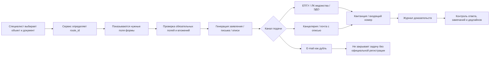

# Автоматизация формирования и отправки писем в инстанции

**Документ:** рабочая карта для сервиса, который формирует заявки, письма, комплекты вложений и контролирует сроки подачи по объектам из плана за апрель 2026 года.

**Дата подготовки:** 28.06.2026

**Основа:** исходный план документов и подготовленный реестр автоматизации: инстанции, маршруты, формы, поля, сроки, документы из файла, архитектура сервиса и источники.

> Важно: e-mail в этом документе указан как канал маршрутизации и дублирования. Для юридически значимой подачи сервис должен фиксировать официальный канал: ЕПГУ, личный кабинет ведомства, ЭДО, канцелярию, почтовое отправление с описью или иной установленный порядок. Задача не должна считаться закрытой без квитанции, входящего номера, описи или другого доказательства регистрации.

---

## Содержание

1. [Цель автоматизации](#1-цель-автоматизации)
2. [Схема процесса](#2-схема-процесса)
3. [Сводка и принципы внедрения](#3-сводка-и-принципы-внедрения)
4. [Что уточнить перед разработкой](#4-что-уточнить-перед-разработкой)
5. [Инстанции и адресаты](#5-инстанции-и-адресаты)
6. [Маршруты, шаблоны и состав документов](#6-маршруты-шаблоны-и-состав-документов)
7. [Поля формы специалиста](#7-поля-формы-специалиста)
8. [Сроки, триггеры и доказательства](#8-сроки-триггеры-и-доказательства)
9. [Документы из исходного файла и назначенные маршруты](#9-документы-из-исходного-файла-и-назначенные-маршруты)
10. [Архитектура сервиса](#10-архитектура-сервиса)
11. [Источники для проверки форм и норм](#11-источники-для-проверки-форм-и-норм)

---

## 1. Цель автоматизации

Сервис должен убрать ручную подготовку однотипных писем и заявлений, снизить риск пропуска сроков и обеспечить доказуемость подачи документов. Специалист выбирает объект и тип документа, заполняет форму, прикрепляет обязательные вложения, после чего система формирует пакет документов, подбирает инстанцию и официальный канал подачи, создает исходящий номер и контролирует регистрацию обращения.

Ключевая логика: **объект + лицензия + тип документа + route_id → адресат + шаблон + обязательные поля + обязательные вложения + срок + канал подачи + доказательство исполнения**.

---

## 2. Схема процесса

---

## 3. Сводка и принципы внедрения

Назначение: превратить исходный Excel-план в правила сервиса: кто заполняет форму, какие поля обязательны, какой шаблон формируется, куда и каким каналом подается документ, какие сроки и доказательства контролируются.

### 3.1. Метрики реестра

| Показатель | Значение | Комментарий |
| --- | --- | --- |
| Инстанций в реестре | 15 | Основные адресаты и резервные маршруты |
| Маршрутов/шаблонов | 27 | Каждый маршрут соответствует группе документов из файла |
| Строк документов из файла | 167 | Все найденные строки документов, кроме повторных заголовков |
| Высокий риск | 63 | Нет документа, истекший срок или просрочка по примечанию |
| Нужно уточнить | 6 | Аббревиатуры/ГОЧС без нормативной классификации |

### 3.2. Принципы сервиса

| Принцип | Как реализовать в сервисе |
| --- | --- |
| Не отправлять важные документы только на e-mail | Для юридически значимых сроков хранить официальный канал: ЕПГУ, ЛК ведомства, ЭДО, почта с описью, канцелярия. E-mail — дублирующий канал. |
| Одна строка = один документ/одно обязательство | В карточке хранить объект, лицензию, адресата, route_id, дедлайн, ответственного, статус и доказательство отправки. |
| Шаблон выбирается автоматически | document_type + route_id → нужная форма, поля, вложения, адресат, канал подачи. |
| Без входящего номера задача не закрывается | Статус “Отправлено” не равен “Зарегистрировано”. Нужно хранить квитанцию/входящий номер/опись. |
| Сроки считать от внешнего дедлайна назад | Напоминания: 180/90/60/30/14/7 дней; для критичных — 365/240 дней. |

---

## 4. Что уточнить перед разработкой

| Что уточнить перед разработкой | Зачем нужно |
| --- | --- |
| Реквизиты вашей организации и подписанты | Чтобы автоматически формировать шапки, доверенности, подписи и исходящие номера |
| Даты окончания всех лицензий и договоров | Чтобы включить календарь сроков и предупреждения |
| Кадастровые номера и муниципалитеты по каждому объекту | Чтобы правильно выбрать КУМИ/администрацию и земельный маршрут |
| Категория НВОС по каждому объекту | Чтобы выбрать Росприроднадзор или региональный орган и правильный экологический режим |
| Расшифровка ОПР и строк ГО и ЧС | Чтобы не автоматизировать неверный документ |

**Примечание:** Дата подготовки реестра: 28.06.2026. Реестр — рабочая карта автоматизации, перед промышленным запуском формы нужно сверить с юристом/проектировщиком и актуальными карточками госуслуг на дату отправки.

---

## 5. Инстанции и адресаты

Важно: e-mail указан для маршрутизации и дубля. Для соблюдения сроков сервис должен фиксировать официальный канал подачи и входящий номер/квитанцию.

| ID | Инстанция / адресат | Блок | Что отправляем по вашему файлу | Основной юридически значимый канал | E-mail / контакт для маршрутизации | Адрес / примечание | Сроковой контроль в сервисе | Источник / форма | Статус уверенности |
| --- | --- | --- | --- | --- | --- | --- | --- | --- | --- |
| A01 | Департамент по недропользованию по Уральскому ФО (Уралнедра) / Роснедра | Недра / лицензии / техпроекты | Лицензия, внесение изменений, продление, технический проект, протокол ТКР, реестр согласований | Личный кабинет недропользователя, ЕПГУ, лично/почтой; e-mail только как дубль и для переписки | ural@rosnedra.gov.ru; sverdlovsk@rosnedra.gov.ru; urallicenz@rosnedra.gov.ru | 620014, Екатеринбург, ул. Вайнера, 55 | Продление лицензии контролировать минимум за 3 месяца до окончания; изменения — до начала работ по измененному проекту | https://rosnedra.gov.ru/activity/gosudarstvennye-uslugi/litsenzirovanie-polzovaniya-nedrami/ https://ufo.rosnedra.gov.ru/stranitsy/kontakty/ https://ufo.rosnedra.gov.ru/stranitsy/contact_adress/ | Высокая |
| A02 | ФГКУ «Росгеолэкспертиза» | ГРР / экспертиза проектной документации | Заявка на экспертизу проекта ГРР, изменения проекта ГРР, раздел календарного плана | Заявка в ФГКУ «Росгеолэкспертиза» по действующему порядку; проверять личный кабинет/официальный порядок подачи | Контакт/кабинет уточнять по карточке услуги и сайту ФГКУ | Федеральное учреждение Роснедр | После регистрации заявки срок экспертизы обычно до 29 рабочих дней; 15 рабочих дней для экспертизы только раздела календарного плана | https://www.rgexp.ru/%D1%8D%D0%BA%D1%81%D0%BF%D0%B5%D1%80%D1%82%D0%B8%D0%B7%D0%B0-%D0%BF%D1%80%D0%BE%D0%B5%D0%BA%D1%82%D0%BE%D0%B2-%D0%B3%D0%B5%D0%BE%D0%BB%D0%BE%D0%B3%D0%B8%D1%87%D0%B5%D1%81%D0%BA%D0%BE%D0%B3%D0%BE/ https://rosnedra.gov.ru/activity/ekspertiza-proektov-geologicheskogo-izucheniya-nedr/ | Высокая |
| A03 | ФБУ «ГКЗ» / ТКЗ по компетенции | Запасы / ТЭО / кондиции | Протокол ТКЗ, материалы подсчета запасов, ТЭО кондиций, геологическая информация | Официальная форма заявления на государственную экспертизу запасов; канал подачи сверить на дату отправки | Контакты и формы через сайт ФБУ ГКЗ | ФБУ ГКЗ; для местного значения может быть региональная комиссия/уполномоченный орган | Добыча/постановка запасов — только после госэкспертизы запасов; контролировать до подачи техпроекта/добычи | https://gkz-rf.ru/ https://gkz-rf.ru/news/na-sayte-razmescheny-formy-zapolneniya-zayavleniya-na-gosekspertizu-zapasov https://gkz-rf.ru/sites/default/files/media/files/2025-03/postanovlenie_pravitelstva_335.pdf | Высокая |
| A04 | Уральское управление Ростехнадзора | Промышленная безопасность / горные работы | Горный отвод, уточнение границ горного отвода, ПРГР, ОПО, лицензирование маркшейдерских работ | ЕПГУ/официальный порядок госуслуги, канцелярия, почта; e-mail как дубль | info@ural.gosnadzor.gov.ru; приемная и канцелярия по карточке управления | Уральское управление Ростехнадзора | ПРГР — ежегодный график рассмотрения; горный отвод — до работ в соответствующих границах | https://www.ural.gosnadzor.ru/contacts/ https://www.ural.gosnadzor.ru/activity/plans/ https://minjust.consultant.ru/documents/25434 | Высокая |
| A05 | Министерство природных ресурсов и экологии Свердловской области / лесной блок | Лесной фонд / лесопользование | План лесного участка, кадастровые работы, договор аренды лесного участка, проект освоения лесов, экспертиза проекта, лесная декларация, лесовосстановление | Региональная госуслуга/ЕПГУ/канцелярия; e-mail как дубль | mpre@egov66.ru; +7 (343) 312-03-30; канцелярия +7 (343) 312-00-13 | 620004, Екатеринбург, ул. Малышева, 101 | До фактического использования лесного участка; лесная декларация — до начала заявленного периода лесопользования | https://mprso.midural.ru/about/contacts/ https://mprso.midural.ru/activity/566/ | Высокая |
| A06 | Рослесхоз / Минприроды России / Правительство РФ | ОЗУ / перевод земель лесного фонда | Пакет документов Рослесхоз, Минприроды РФ, Правительство РФ по переводу земель лесного фонда | ЕПГУ: ходатайство о переводе земель лесного фонда; ведомственный маршрут Рослесхоз → Минприроды РФ → Правительство РФ | Через ЕПГУ и ведомственные кабинеты; e-mail не должен быть единственным каналом | Федеральный маршрут; зависит от категории и правообладателя участка | Запускать за несколько месяцев до потребности в земельном участке; без перевода категории нельзя рассчитывать на быстрый старт работ | https://rosleshoz.gov.ru/news/federal/rosleskhoz-usluga-po-rassmotreniyu-khodataystva-o-perevode-zemel-lesnogo-fonda-v-zemli-inykh-kategoriy-dostupna-teper-v-elektronnom-formate-n10182/ https://normativ.kontur.ru/document?documentId=471598&moduleId=1 | Высокая |
| A07 | Муниципалитет / КУМИ / местная администрация по месту участка | Земля муниципальная / ВРИ / аренда ЗУ | Межевой план, перевод категории ЗУ, изменение ВРИ, договор аренды ЗУ, постановление администрации НГО/НТГО | Муниципальный портал/канцелярия/МФЦ/ЕПГУ; конкретный адресат определяется по кадастровому номеру и муниципалитету | Уточняется по объекту: НГО/НТГО/иное муниципальное образование | Администрация и комитет по управлению имуществом соответствующего муниципалитета | До оформления прав на земельный участок и до начала работ; триггер — готовность схемы/межевого плана | Нужны кадастровый номер, муниципалитет и правообладатель; универсального одного e-mail нет | Средняя: нужен кадастровый контур |
| A08 | Росводресурсы / Нижне-Обское БВУ / Отдел водных ресурсов по Свердловской области | Водопользование | Договор водопользования, решение о предоставлении водного объекта, допсоглашение/продление | ЕПГУ/госуслуга Росводресурсов, территориальный отдел, почта/канцелярия | ovrsvr@yandex.ru; (343) 374-66-73 | 620014, Екатеринбург, ул. Мира, 23, каб. 401/402/406 | До начала водопользования и минимум за 90/60/30 дней до окончания действующего договора по внутреннему контролю | https://voda.gov.ru/activities/gosudarstvennye-uslugi/predostavlenie-prava-polzovaniya-vodnymi-obektami-na-osnovanii-dogovorov-vodopolzovaniya/ https://voda.gov.ru/activities/gosudarstvennye-uslugi/ https://voda.gov.ru/favr/structure/bvu/department/7256/ | Высокая |
| A09 | Нижнеобское ТУ Росрыболовства, отдел по Свердловской области | ВБР / водотоки / согласование деятельности | Оценка воздействия на водные биоресурсы, согласование хозяйственной деятельности на водотоке | ЕПГУ/электронный документ с УКЭП, лично или почтовым отправлением с описью | goscontrol66@tmn.fish.gov.ru; 8 (343) 350-72-05 | 620133, Екатеринбург, ул. Мамина-Сибиряка, 85, офис 213 | До начала работ на водотоке/в водоохранной зоне; привязать к календарю полевых/строительных работ | https://sztu.fish.gov.ru/soglasovanie-razmeshcheniya-khozyajstvennykh-i-inykh-obektov/trebovaniya-predyavlyaemye-k-dokumentam-dlya-soglasovaniya/ https://etu.fish.gov.ru/activities/water-use/soglasovanie-deyatelnosti-okazyvayushhej-vozdejstv/ https://tmn.fish.gov.ru/territory/Sverdlovsk_Oblast/ | Высокая |
| A10 | Управление Роспотребнадзора по Свердловской области | Санитарно-эпидемиологический блок | Санитарно-эпидемиологическая экспертиза и санитарно-эпидемиологическое заключение на проект | ЕПГУ/интерактивная форма, официальная госуслуга; e-mail для переписки | mail@66.rospotrebnadzor.ru; +7 343 374-13-79 | 620078, Екатеринбург, пер. Отдельный, 3 | До подачи материалов на разрешение/нормирование, если требуется реквизит СЭЗ | https://www.rospotrebnadzor.ru/gosserv/for/11/category/90/29839/ https://zpp.rospotrebnadzor.ru/organizations/gos/500422 | Высокая |
| A11 | Уральское межрегиональное управление Росприроднадзора | Экология / НВОС / выбросы / отходы / ГЭЭ | ПДВ/НДВ, разрешение на выбросы/временные выбросы, декларация о воздействии, КЭР, учет НВОС, отходы, 2-ТП рекультивация | ЕПГУ/личный кабинет природопользователя/официальный сайт; e-mail как дубль | rpn66@rpn.gov.ru; приемная (343)257-22-81 по данным управления | 620014, Екатеринбург, ул. Вайнера, 55 | Зависит от категории НВОС; временные выбросы — продление не позднее 30 рабочих дней до окончания разрешения | https://rpn.gov.ru/regions/66/contacts/ https://rpn.gov.ru/regions/66/gov-services/temporary-emissions-air/ https://rpn.gov.ru/regions/66/for_users/otchety-prirodopolzovatelya/environment-declaration/ https://rpn.gov.ru/regions/66/gov-services/complex-eco-approval/ | Высокая |
| A12 | Региональный орган экологии Свердловской области | Экология регионального надзора | Декларация о воздействии/прочие экологические документы по объектам не федерального надзора | ЕПГУ/региональная госуслуга/канцелярия | mpre@egov66.ru | 620004, Екатеринбург, ул. Малышева, 101 | Определяется категорией НВОС и уровнем надзора; сервис должен хранить категорию объекта | https://mprso.midural.ru/about/contacts/ https://rpn.gov.ru/regions/66/for_users/otchety-prirodopolzovatelya/environment-declaration/ | Средняя: зависит от категории НВОС |
| A13 | Орган согласования проекта рекультивации: правообладатель/арендодатель земли, лесной орган, муниципалитет, иногда Росприроднадзор | Рекультивация | Проект рекультивации, акты выполненных работ, уведомления о сдаче, отчеты по судебным обязательствам | По категории земли и правообладателю: лесной фонд — лесной орган; муниципальные земли — администрация/КУМИ; при ГЭЭ — РПН | Определяется по земельному участку и договору; в файле есть судебные дедлайны 01.10.2027 и 01.10.2028 | Адресат определяется автоматически по land_category + land_holder + contract/court_obligation | Контролировать от финального дедлайна: 180/90/60/30/14/7 дней; без акта приемки считать риск незакрытым | http://government.ru/docs/33190/ https://mprso.midural.ru/about/contacts/ https://rpn.gov.ru/regions/66/contacts/ | Высокая по логике, адресат уточняется по земле |
| A14 | МЧС / ГО и ЧС / муниципальная комиссия ЧС | ГО и ЧС | В файле есть направление ГО и ЧС, но не раскрыты конкретные документы; автоматизацию включать после расшифровки документа | По конкретной госуслуге/регламенту; e-mail не использовать как единственный юридический канал | Уточняется после перечня ГОЧС-документов | Региональное ГУ МЧС или муниципальный орган — зависит от документа | До эксплуатации/проведения работ, если документ обязателен для объекта | Требуется уточнение: ПЛА/ПМЛА/ПЛРН/паспорт безопасности/иная форма | Низкая: в исходном файле нет названий документов |
| A15 | Суд / ФССП / контрагент по договору рекультивации, если есть судебное обязательство | Судебные обязательства / исполнение | Письма о ходе исполнения, акты рекультивации, подтверждение сдачи по договорам 27/14, 104/13, 157/18, 36/13 | Канал по делу/исполнительному производству/договору; заказное письмо/ГАС/канцелярия, если применимо | Уточняется по номеру дела и исполнительному производству | Адресат зависит от судебного акта и договора | Не позднее судебного срока; автоматические напоминания 180/90/60/30/14/7 дней | Источник — исходный план и судебные/договорные документы, которые нужно прикрепить в сервис | Средняя: нужны номера дел/договоров |

---

## 6. Маршруты, шаблоны и состав документов

Это основная таблица для разработчика: Route ID связывает документ из исходного плана с адресатом, формой, обязательными полями, вложениями и сроком.

| Route ID | Документ / процесс из файла | Основная инстанция | Форма / шаблон документа | Что должно содержаться в заявлении / письме | Обязательные вложения / данные | Срок / триггер отправки | Канал подачи | Источник / форма | Примечание для сервиса |
| --- | --- | --- | --- | --- | --- | --- | --- | --- | --- |
| T01 | Проект ГРР; Экспертиза ГРР | ФГКУ «Росгеолэкспертиза» | Заявка на проведение экспертизы проектной документации ГРР | Заявитель; реквизиты недропользователя; номер лицензии/госконтракта; наименование участка недр; вид работ; наименование проекта; сведения о стоимости/смете; контактное лицо; e-mail для уведомлений; просьба провести экспертизу. | Проектная документация ГРР; календарный план; лицензия; доверенность; платежные документы; электронные файлы по требованиям ФГКУ. | До начала работ по ГРР или изменения календарного плана; после подачи контролировать 2 рабочих дня на уведомление о недостатках и 29/15 рабочих дней на экспертизу. | Официальный порядок ФГКУ/Роснедр; не просто e-mail. | https://www.rgexp.ru/%D1%8D%D0%BA%D1%81%D0%BF%D0%B5%D1%80%D1%82%D0%B8%D0%B7%D0%B0-%D0%BF%D1%80%D0%BE%D0%B5%D0%BA%D1%82%D0%BE%D0%B2-%D0%B3%D0%B5%D0%BE%D0%BB%D0%BE%D0%B3%D0%B8%D1%87%D0%B5%D1%81%D0%BA%D0%BE%D0%B3%D0%BE/ https://rosnedra.gov.ru/activity/ekspertiza-proektov-geologicheskogo-izucheniya-nedr/ | Сервис должен различать полную экспертизу и экспертизу только календарного плана. |
| T02 | Протокол ТКЗ; ТЭО кондиций; материалы запасов | ФБУ ГКЗ / ТКЗ / уполномоченный орган по компетенции | Заявление на проведение государственной экспертизы запасов | Заявитель; лицензия; участок недр; вид полезного ископаемого; вид материалов: подсчет запасов/ТЭО кондиций/геологическая информация; цель экспертизы; перечень материалов; сведения об оплате; контактное лицо. | Материалы подсчета запасов; ТЭО кондиций; графика/таблицы; электронная версия; лицензия; доверенность; платежные документы; сопроводительное письмо. | До постановки запасов на баланс, до добычи/техпроекта, когда проект требует протокол ТКЗ. | Официальная форма ГКЗ/территориальной комиссии. | https://gkz-rf.ru/ https://gkz-rf.ru/news/na-sayte-razmescheny-formy-zapolneniya-zayavleniya-na-gosekspertizu-zapasov https://gkz-rf.ru/sites/default/files/media/files/2025-03/postanovlenie_pravitelstva_335.pdf | По ОПИ/местному значению проверить, не относится ли участок к компетенции субъекта. |
| T03 | Технический проект; изменение календарного плана; протокол ТКР | Уралнедра / комиссия Роснедр по согласованию техпроектов | Заявление о согласовании технического проекта / изменений | Заявитель; лицензия; месторождение; вид технической проектной документации; наименование проекта; основание разработки/изменений; краткая суть изменений; просьба согласовать; сведения о запасах/экспертизах; контакт. | Техпроект; пояснительная записка; графическая часть; протокол/заключение запасов; положительные заключения, если требуются; доверенность; электронная версия; сопроводительная опись. | До работ по проекту; для продления лицензии и изменения календарного плана — до истечения контрольного срока лицензии/проекта. | ЛК недропользователя/ЕПГУ/официальная комиссия; e-mail только дубль. | https://cfo.rosnedra.gov.ru/deyatelnost/formy-obrashcheniy-zayavleniy/ https://normativ.kontur.ru/document?documentId=502756&moduleId=1 https://ufo.rosnedra.gov.ru/stranitsy/kontakty/ | В исходном файле это критично для Ивановского Увала и Черного Шишима. |
| T04 | Горный отвод | Уральское управление Ростехнадзора | Заявление об оформлении/уточнении документов горного отвода | Заявитель; лицензия; участок недр; месторождение; реквизиты согласованного техпроекта; координаты и площадь горного отвода; цель работ; контакт. | Лицензия; согласованный техпроект; графика и координаты; протокол ТКР/ТКЗ; правоустанавливающие документы; доверенность. | До начала добычных работ в соответствующих границах; при изменении границ — до работ в измененной зоне. | Госуслуга/Ростехнадзор/канцелярия. | https://www.ural.gosnadzor.ru/contacts/ | Нужен контроль связки: техпроект согласован → горный отвод → ПРГР. |
| T05 | Проект ликвидации объекта | Уралнедра / Роснедра; при необходимости Росприроднадзор/земельный орган | Заявление о согласовании технического проекта ликвидации/консервации | Заявитель; лицензия; объект ликвидации; основание ликвидации; вид сооружений; сроки; мероприятия; просьба согласовать; контакт. | Проект ликвидации; графика; расчеты; рекультивационные решения; экологические заключения, если требуются; доверенность; опись. | До фактической ликвидации/консервации; учитывать сроки лицензии и рекультивации. | ЛК недропользователя/ЕПГУ/официальный порядок. | https://normativ.kontur.ru/document?documentId=502756&moduleId=1 https://ufo.rosnedra.gov.ru/stranitsy/kontakty/ http://government.ru/docs/33190/ | Для Ольховской в файле проект ликвидации находится в стадии устранения замечаний. |
| T06 | Лицензия: продление, изменение, переоформление | Роснедра / Уралнедра | Заявление о внесении изменений/переоформлении/продлении лицензии | Заявитель; реквизиты лицензии; участок недр; вид изменения; основание; обоснование необходимости; подтверждение выполнения условий лицензии; список приложений; контакт. | Лицензия; подтверждение выполнения условий; техпроект/протоколы/отчеты; доверенность; платежка госпошлины; иные основания. | Продление — не позднее чем за 3 месяца до окончания срока пользования участком; изменения — до события, требующего изменения лицензии. | Личный кабинет недропользователя, ЕПГУ, лично/почтой. | https://rosnedra.gov.ru/activity/gosudarstvennye-uslugi/litsenzirovanie-polzovaniya-nedrami/ https://ufo.rosnedra.gov.ru/stranitsy/kontakty/ | Сервис должен хранить дату окончания каждой лицензии как отдельное обязательное поле. |
| T07 | ПРГР / ПРГР 2025 / ПРГР 2026 | Уральское управление Ростехнадзора | Заявление о согласовании плана и/или схемы развития горных работ | Заявитель; ОПО/месторождение; лицензия; вид полезного ископаемого; год плана; сведения о проектной документации; контакт; просьба согласовать ПРГР. | План/схема развития горных работ; пояснительная записка; графическая часть; табличные материалы; техпроект; горный отвод; доверенность. | Ежегодно по графику Ростехнадзора до начала планируемых горных работ на год. | Ростехнадзор/официальный график/госуслуга. | https://www.ural.gosnadzor.ru/activity/plans/ https://minjust.consultant.ru/documents/25434 | Приказ №537 действует до 01.01.2027; в 2027 проверить новый порядок. |
| T08 | Лицензия на ведение маркшейдерских работ | Ростехнадзор | Заявление о предоставлении/переоформлении лицензии на маркшейдерские работы | Заявитель; ИНН/ОГРН; виды работ; адреса мест осуществления деятельности; сведения о персонале/оборудовании/документах; контакт. | Учредительные документы; сведения о специалистах; документы на оборудование/ПО; доверенность; госпошлина; положение о контроле качества. | До выполнения маркшейдерских работ собственными силами; контролировать срок лицензии и изменения адресов/работ. | ЕПГУ/Ростехнадзор. | https://www.ural.gosnadzor.ru/contacts/ | Если работы выполняет подрядчик, сервис должен хранить лицензию подрядчика и срок ее действия. |
| T09 | План лесного участка; проект на земли; кадастровые работы в лесном фонде | Минприроды Свердловской области / лесной департамент | Заявление о формировании лесного участка / предоставлении данных / согласовании кадастровых работ | Заявитель; цель использования; местоположение: лесничество, кварталы, выделы; площадь; основание недропользования; сведения о лицензии; срок использования; контакт. | Схема расположения; координаты; лицензия; ситуационный план; проектные материалы; доверенность; согласия, если нужны. | До аренды лесного участка и до работ на землях лесного фонда. | Региональная госуслуга/канцелярия/ЕПГУ. | https://mprso.midural.ru/activity/566/ https://mprso.midural.ru/about/contacts/ | Для сервиса критичны поля: лесничество, участковое лесничество, квартал, выдел. |
| T10 | Договор аренды лесного участка | Минприроды Свердловской области / лесной департамент | Заявление о предоставлении лесного участка в аренду | Заявитель; основание предоставления; лесной участок; цель использования; срок аренды; реквизиты лицензии на недра; контакт. | План/схема участка; кадастровые материалы; лицензия; документы заявителя; доверенность; согласования. | До начала использования лесного участка; контролировать окончание договора аренды. | Региональная госуслуга/канцелярия/ЕПГУ. | https://mprso.midural.ru/activity/566/ https://mprso.midural.ru/about/contacts/ | Сервис должен напоминать о продлении/новом договоре заранее. |
| T11 | Проект освоения лесов; экспертиза проекта | Минприроды Свердловской области / лесной департамент | Заявление о проведении государственной экспертизы проекта освоения лесов | Заявитель; договор аренды; лесной участок; проект освоения лесов; вид использования лесов; срок; контакт. | Проект освоения лесов; договор аренды; план лесного участка; доверенность; электронная версия; опись. | После заключения договора аренды и до подачи лесной декларации/начала лесопользования. | Региональная госуслуга/лесной орган. | https://mprso.midural.ru/activity/566/ https://mprso.midural.ru/about/contacts/ | Сервис должен блокировать лесную декларацию без положительной экспертизы ПОЛ. |
| T12 | Лесная декларация | Минприроды Свердловской области / лесной департамент | Лесная декларация по утвержденной форме | Арендатор; договор аренды; лесной участок; вид использования лесов; объемы и сроки работ; меры охраны/защиты/воспроизводства; контакт. | Лесная декларация; положительная экспертиза проекта освоения лесов; договор аренды; карта-схема; доверенность. | До начала заявленного периода использования лесов; контролировать ежегодность/периодичность по договору. | Региональная госуслуга/ЕПГУ/лесной орган. | https://mprso.midural.ru/activity/566/ | Нужна связка с календарем работ, чтобы декларация была подана до начала работ. |
| T13 | Лесовосстановление | Минприроды Свердловской области / лесной департамент | Уведомление/проект/отчет о лесовосстановлении по конкретной обязанности | Заявитель; основание обязанности; участок; площадь; способ лесовосстановления; сроки; породы; подрядчик; контакт. | Проект/акт/отчет; карта участка; договор; фотофиксация; ведомости посадочного материала; доверенность. | По срокам договора аренды, проекта освоения лесов и предписаний. | Лесной орган/канцелярия/ЕПГУ. | https://mprso.midural.ru/activity/566/ https://mprso.midural.ru/about/contacts/ | Точную форму нужно привязать к виду обязанности: компенсационное, искусственное, комбинированное. |
| T14 | Рекультивация; проект рекультивации | Орган по категории/правообладателю земли; для лесного фонда — лесной орган; для муниципальной земли — КУМИ/администрация | Проект рекультивации / сопроводительное письмо о согласовании / письмо о сдаче работ | Заявитель; участок; кадастровый номер; категория земли; площадь нарушенных земель; основание нарушения; цели рекультивации; технический и биологический этапы; сроки; ответственный; просьба согласовать/принять. | Проект рекультивации; графика; смета/календарь; правоустанавливающие документы; договоры; акты; фото; лабораторные данные; доверенность. | До начала работ, а сдача — до судебных/договорных сроков. В файле: Ивановский Увал до 01.10.2027; Кучум до 01.10.2028. | Канал зависит от адресата: лесной орган, КУМИ, Росприроднадзор, суд/ФССП. | http://government.ru/docs/33190/ https://mprso.midural.ru/about/contacts/ https://rpn.gov.ru/regions/66/contacts/ | Сервис должен хранить два дедлайна: срок завершения работ и срок сдачи/акта приемки. |
| T15 | Межевой план | Росреестр/МФЦ/муниципалитет/КУМИ по маршруту участка | Заявление о кадастровом учете / передача межевого плана | Заявитель; кадастровый инженер; исходный участок; образуемые участки; площадь; координаты; основание образования; контакт. | Межевой план XML/PDF; схема расположения; правоустанавливающие документы; доверенность; решение/постановление, если нужно. | До договора аренды/изменения ВРИ/перевода категории. | Росреестр/МФЦ/ЕПГУ или передача в КУМИ по муниципальной процедуре. | Нужен кадастровый инженер и муниципалитет; источник зависит от участка. | В сервисе это лучше вести как вложение к земельному маршруту, не отдельное письмо. |
| T16 | Перевод категории ЗУ | Рослесхоз/Правительство РФ или регион/муниципалитет — зависит от категории земли | Ходатайство о переводе земельного участка из одной категории в другую | Заявитель; кадастровый номер; площадь; местоположение; текущая и запрашиваемая категория; права на участок; обоснование; согласие правообладателя; цель использования. | Правоустанавливающие документы; кадастровые сведения; схема; лицензия на недра; обоснование невозможности использования в текущей категории; согласия; доверенность. | До предоставления/использования участка по новой категории; для лесного фонда запускать максимально заранее. | ЕПГУ/Рослесхоз для лесного фонда; иной орган — по категории участка. | https://rosleshoz.gov.ru/news/federal/rosleskhoz-usluga-po-rassmotreniyu-khodataystva-o-perevode-zemel-lesnogo-fonda-v-zemli-inykh-kategoriy-dostupna-teper-v-elektronnom-formate-n10182/ https://normativ.kontur.ru/document?documentId=471598&moduleId=1 | Сервис должен сначала определить исходную категорию земли. |
| T17 | Изменение разрешенного использования ЗУ | Администрация / КУМИ / Росреестр по месту участка | Заявление об изменении вида разрешенного использования | Заявитель; кадастровый номер; текущий и запрашиваемый ВРИ; основание; градостроительная зона; цель недропользования; контакт. | Выписка ЕГРН; схема; документы на участок; лицензия; обоснование; доверенность. | До договора аренды/начала работ, если текущий ВРИ не позволяет деятельность. | Муниципальная услуга/МФЦ/ЕПГУ/Росреестр. | Нужна карточка муниципалитета и градрегламент. | Автоматизация невозможна без кадастрового номера и ПЗЗ. |
| T18 | Договор аренды ЗУ | КУМИ / администрация / правообладатель земли | Заявление о предоставлении земельного участка в аренду | Заявитель; кадастровый номер; площадь; цель использования; срок аренды; основание без торгов/через торги; реквизиты лицензии; контакт. | Схема/межевой план; выписка ЕГРН; лицензия; решение о переводе/ВРИ; доверенность; проект договора. | До начала работ и размещения объектов на земле. | Муниципальная/региональная услуга/канцелярия/МФЦ. | Нужен конкретный собственник/муниципалитет. | В сервисе адресат должен определяться по owner_type и municipality. |
| T19 | Постановление администрации НГО/НТГО | Администрация соответствующего городского округа | Заявление о принятии муниципального правового акта | Заявитель; объект; участок; основание принятия постановления; требуемое действие: предоставление/изменение/согласование; контакт. | Пакет земельных документов; согласования; лицензия; схема; доверенность; проект постановления, если требуется. | До земельного договора/регистрации/начала работ. | Муниципальная канцелярия/портал/МФЦ. | Источник уточняется по НГО/НТГО. | Нужно расшифровать НГО и НТГО для каждого объекта. |
| T20 | ОЗУ: пакет Рослесхоз / Роснедра / Минприроды РФ / Правительство РФ | Рослесхоз + Минприроды РФ + Правительство РФ; Роснедра как подтверждающий недропользование орган | Комплект ходатайства и межведомственных писем по переводу земель лесного фонда | Ходатайство; заявитель; участок лесного фонда; кадастровый номер/местоположение; площадь; права; цель перевода; обоснование; реквизиты лицензии; подтверждение необходимости для недропользования. | Кадастровые сведения; материалы лесоустройства; схема; лицензия; проектные материалы; согласие правообладателя; заключения; доверенность. | Запускать до земельного этапа с большим запасом; учитывать межведомственный маршрут. | ЕПГУ и ведомственный маршрут Рослесхоза. | https://rosleshoz.gov.ru/news/federal/rosleskhoz-usluga-po-rassmotreniyu-khodataystva-o-perevode-zemel-lesnogo-fonda-v-zemli-inykh-kategoriy-dostupna-teper-v-elektronnom-formate-n10182/ https://normativ.kontur.ru/document?documentId=471598&moduleId=1 https://rosnedra.gov.ru/activity/gosudarstvennye-uslugi/litsenzirovanie-polzovaniya-nedrami/ | Для Ключевского Лога это ключевой процесс по текущему статусу. |
| T21 | Разработка проекта нормативов ПДВ; нормирование ПДВ/НДВ; разрешение на выбросы | Росприроднадзор или региональный орган — зависит от категории НВОС и вида разрешения | Заявление об установлении НДВ/ВРВ/выдаче разрешения на выбросы или декларация/КЭР | Заявитель; объект НВОС; категория; адрес площадки; источники выбросов; вещества; значения нормативов/ВРВ; реквизиты СЭЗ, если требуется; контакт. | Инвентаризация источников; расчеты НДВ; проект плана мероприятий; СЭЗ; сведения об объекте НВОС; госпошлина для ВРВ; доверенность. | До эксплуатации источников/истечения действующего разрешения; ВРВ продлевать не позднее 30 рабочих дней до окончания. | ЕПГУ/ЛК природопользователя/РПН. | https://rpn.gov.ru/regions/66/gov-services/temporary-emissions-air/ https://rpn.gov.ru/regions/66/for_users/otchety-prirodopolzovatelya/environment-declaration/ https://rpn.gov.ru/regions/66/gov-services/complex-eco-approval/ | Сервис должен сначала спросить категорию НВОС: I, II, III, IV. |
| T22 | Санитарно-эпидемиологическая экспертиза и заключение на проект | Роспотребнадзор по Свердловской области | Заявление о выдаче санитарно-эпидемиологического заключения на проектную документацию | Заявитель; наименование проекта; объект и адрес; вид проектной документации; сведения об экспертизе/исследованиях; контакт; просьба выдать СЭЗ. | Проектная документация; результаты санитарно-эпидемиологической экспертизы/исследований/оценок; доверенность; электронные документы. | До подачи на экологическое нормирование/разрешение, если реквизиты СЭЗ нужны в заявке. | ЕПГУ/интерактивная форма Роспотребнадзора. | https://www.rospotrebnadzor.ru/gosserv/for/11/category/90/29839/ https://zpp.rospotrebnadzor.ru/organizations/gos/500422 | В сервисе разделить: «экспертиза» и «заключение» — это разные стадии. |
| T23 | Договор водопользования | Росводресурсы / Нижне-Обское БВУ / Отдел водных ресурсов по Свердловской области | Заявление о предоставлении водного объекта в пользование | Заявитель; водный объект; цель водопользования; место/координаты; объемы/площадь; срок; способ использования; реквизиты объекта/участка; контакт. | Схема водного объекта; координаты; расчет объемов; документы на землю/объект; проектные материалы; доверенность; согласования. | До начала водопользования; действующие договоры продлевать/переоформлять заранее, внутренний минимум 90/60/30 дней. | ЕПГУ/Росводресурсы/территориальный отдел. | https://voda.gov.ru/activities/gosudarstvennye-uslugi/predostavlenie-prava-polzovaniya-vodnymi-obektami-na-osnovanii-dogovorov-vodopolzovaniya/ https://voda.gov.ru/activities/gosudarstvennye-uslugi/ https://voda.gov.ru/favr/structure/bvu/department/7256/ | В файле у Черного Шишима договор до 15.10.2023 — сервис должен маркировать как просроченный. |
| T24 | Оценка воздействия на биоресурсы и среду их обитания | Нижнеобское ТУ Росрыболовства, отдел по Свердловской области | Раздел/материалы оценки воздействия на ВБР + сопроводительное письмо | Заявитель; объект; водный объект; координаты; описание планируемых работ; сроки; оценка воздействия; меры сохранения ВБР и среды обитания; контакт. | Проектная документация/программа работ; расчет вреда/воздействия; меры сохранения ВБР; карты; доверенность. | До согласования хозяйственной деятельности и до работ на водотоке. | ЕПГУ/Росрыболовство; электронный документ с УКЭП, лично или почтой с описью. | https://sztu.fish.gov.ru/soglasovanie-razmeshcheniya-khozyajstvennykh-i-inykh-obektov/trebovaniya-predyavlyaemye-k-dokumentam-dlya-soglasovaniya/ https://etu.fish.gov.ru/activities/water-use/soglasovanie-deyatelnosti-okazyvayushhej-vozdejstv/ https://tmn.fish.gov.ru/territory/Sverdlovsk_Oblast/ | Сервис должен хранить water_body_id и периоды работ в русле/водоохранной зоне. |
| T25 | Согласование ведения хозяйственной деятельности на водотоке с ТО Росрыболовства | Нижнеобское ТУ Росрыболовства | Заявка о согласовании деятельности, оказывающей воздействие на ВБР и среду их обитания | Заявитель; сведения о проектной документации; наименование и местоположение деятельности; водный объект; сроки; технологии; меры сохранения ВБР; контакт. | Проектная документация или программа работ; документ с мерами сохранения ВБР; карты/координаты; доверенность; электронные файлы. | До начала строительства/работ/иной деятельности, влияющей на ВБР. | ЕПГУ/УКЭП, лично или почтой с описью. | https://sztu.fish.gov.ru/soglasovanie-razmeshcheniya-khozyajstvennykh-i-inykh-obektov/trebovaniya-predyavlyaemye-k-dokumentam-dlya-soglasovaniya/ https://etu.fish.gov.ru/activities/water-use/soglasovanie-deyatelnosti-okazyvayushhej-vozdejstv/ https://tmn.fish.gov.ru/territory/Sverdlovsk_Oblast/ | Сервис должен проверять наличие оценки ВБР до формирования заявки. |
| T26 | ГО и ЧС: документ не расшифрован в файле | МЧС/муниципалитет/внутренний контроль — после уточнения | Шаблон не формировать до определения конкретного документа | После уточнения: заявитель; объект; вид опасности; мероприятия; ответственные; контакты; просьба согласовать/принять к сведению. | Зависит от документа: ПЛА, ПМЛА, паспорт безопасности, план действий, иное. | До эксплуатации/начала работ, если обязательность подтверждена. | По регламенту конкретного документа. | Нужно добавить после расшифровки ГО и ЧС строк исходного файла. | Не отправлять автоматически без юридической классификации. |
| T27 | ОПР — в файле не расшифровано | Требуется уточнение | Шаблон-пустышка / запрос уточнения | Запросить у специалиста расшифровку ОПР, нормативное основание, адресата, срок и набор вложений. | Пока неизвестно. | Не ставить автоотправку, только задачу на уточнение. | Внутренняя задача сервиса. | Источник — исходный файл. | Не автоматизировать до расшифровки аббревиатуры. |

---

## 7. Поля формы специалиста

Из этих полей собираются DOCX/PDF/сопроводительные письма и заявки. Часть полей лучше подтягивать из справочников, а не вводить руками.

| Field code | Поле формы специалиста | Тип | Обязательность | Используется в маршрутах | Валидация / правило | Пример / комментарий |
| --- | --- | --- | --- | --- | --- | --- |
| company_full_name | Полное наименование организации | Текст | Обязательно | Все | Не пусто; из карточки юрлица | ООО «...» |
| company_short_name | Сокращенное наименование | Текст | Желательно | Все | Из карточки юрлица | ООО «...» |
| inn | ИНН | Текст | Обязательно | Все | 10 или 12 цифр | 667... |
| kpp | КПП | Текст | Для юрлица | Все | 9 цифр | 667... |
| ogrn | ОГРН/ОГРНИП | Текст | Обязательно | Все | 13/15 цифр | ... |
| legal_address | Юридический адрес | Текст | Обязательно | Все | Адрес из ЕГРЮЛ | ... |
| postal_address | Почтовый адрес | Текст | Обязательно | Все | Не пусто | ... |
| representative_name | Подписант / представитель | Текст | Обязательно | Все | ФИО + должность | Генеральный директор ... |
| power_of_attorney | Доверенность / основание полномочий | Файл/текст | Если подписывает не ЕИО | Все | Файл PDF + реквизиты | Доверенность №... от ... |
| contact_person | Контактный специалист | Текст | Обязательно | Все | ФИО, телефон, e-mail | Иванов И.И., +7..., ... |
| object_name | Объект / месторождение | Справочник | Обязательно | Все | Один из 6 объектов из файла | Черный Шишим |
| license_number | Номер лицензии на недра | Справочник/текст | Обязательно | T01-T08,T20 | Формат вроде СВЕ 03745 БЭ | СВЕ 03745 БЭ |
| license_start_date | Дата начала лицензии | Дата | Желательно | T06,T03 | Дата | ... |
| license_end_date | Дата окончания лицензии | Дата | Критично | T06 | Дата; триггер -3 месяца | ... |
| license_conditions_ref | Условия лицензии / пункт обязательства | Текст/файл | Критично для сроков | T01-T06,T20 | Ссылка на пункт | до 31.12.2024 представить ТЭО... |
| mineral_type | Вид полезного ископаемого | Справочник | Обязательно | T01-T08,T21 | Из лицензии | ... |
| project_name | Наименование проекта/документа | Текст | Обязательно | Все | Не пусто | Дополнение к техническому проекту... |
| project_version | Версия проекта | Текст | Желательно | Все | v1/v2/дата | Ред. 2 от 15.04.2026 |
| requested_action | Что просим сделать | Справочник | Обязательно | Все | согласовать/выдать/продлить/внести изменения/принять отчет | Согласовать технический проект |
| deadline_external | Внешний срок / дедлайн | Дата | Критично | Все | Дата; используется календарем | 01.10.2027 |
| deadline_internal | Внутренний срок подготовки | Дата | Критично | Все | Раньше внешнего срока | за 30 дней до отправки |
| recipient_agency_id | Инстанция | Справочник | Обязательно | Все | A01-A15 | A09 Росрыболовство |
| route_id | Маршрут/шаблон | Справочник | Обязательно | Все | T01-T27 | T23 Договор водопользования |
| submission_channel | Канал подачи | Справочник | Обязательно | Все | ЕПГУ/ЛК/ЭДО/почта с описью/канцелярия/e-mail дубль | ЕПГУ + e-mail дубль |
| signing_method | Способ подписания | Справочник | Обязательно | Все электронные | УКЭП/бумажная подпись | УКЭП директора |
| outgoing_number | Исходящий номер | Текст | После формирования | Все | Уникальный в журнале исходящих | Исх. № 12/06-26 |
| sent_date | Дата отправки | Дата/время | После отправки | Все | Автоматически | 28.06.2026 12:40 |
| agency_incoming_number | Входящий номер ведомства | Текст | После регистрации | Все | Не пусто для юридического доказательства | Вх. №... |
| agency_response_due | Контрольный срок ответа | Дата | После регистрации | Все | Из регламента или вручную | ... |
| attachment_list | Список вложений | Мультифайл | Обязательно | Все | Проверка обязательных вложений по route_id | Проект, лицензия, доверенность... |
| land_cadastral_number | Кадастровый номер земельного участка | Текст | Для земли/леса/рекультивации | T09-T20,T14 | Формат 66:..:..:.. | 66:... |
| land_category | Категория земли | Справочник | Для земли/леса/рекультивации | T09-T20,T14 | лесной фонд/земли промышленности/иное | Земли лесного фонда |
| land_holder | Правообладатель/арендодатель земли | Текст | Для земли/рекультивации | T10,T14,T18 | Определяет адресата | Министерство / КУМИ / РФ |
| municipality | Муниципальное образование | Справочник | Для КУМИ/земли | T15-T19 | НГО/НТГО/иное — расшифровать | Нижнетагильский ГО |
| forest_district | Лесничество / участковое лесничество / квартал / выдел | Текст | Для лесного фонда | T09-T13,T16,T20 | Обязательный лесной адрес | Нижне-Тагильское, квартал... |
| water_body_name | Водный объект | Текст | Для воды/ВБР | T23-T25 | Название из водного реестра/проекта | р. ... |
| water_body_coordinates | Координаты места работ/водопользования | Текст/геоданные | Для воды/ВБР | T23-T25 | WGS/СК + формат | ... |
| nvos_category | Категория объекта НВОС | Справочник | Для экологии | T21 | I/II/III/IV | II |
| emission_sources_inventory | Инвентаризация источников выбросов | Файл | Для ПДВ/ВРВ | T21 | Файл + дата | Инвентаризация от ... |
| sez_details | Реквизиты санитарно-эпидемиологического заключения | Текст/файл | Для ПДВ/ВРВ | T21,T22 | Номер + дата + файл | №... от ... |
| court_case_ref | Номер судебного дела/исполнительного производства | Текст | Для судебной рекультивации | T14,A15 | Не пусто при judicial_obligation=True | Дело №... |

---

## 8. Сроки, триггеры и доказательства

Сроки из ведомственных карточек и исходного файла нужно превратить в события календаря. Задача не закрывается без доказательства регистрации/приемки.

| ID | Процесс | Дата-триггер в системе | Автонапиоминания | Контрольный срок / норматив | Доказательство отправки/исполнения | Источник |
| --- | --- | --- | --- | --- | --- | --- |
| D01 | Продление лицензии на недра | license_end_date | 180/120/100/90/60/30/14/7 дней | Заявка не позднее чем за 3 месяца до истечения срока пользования участком | Квитанция ЕПГУ/ЛК, входящий номер, опись почты | https://rosnedra.gov.ru/activity/gosudarstvennye-uslugi/litsenzirovanie-polzovaniya-nedrami/ |
| D02 | Внесение изменений в лицензию | planned_change_date | 90/60/30/14/7 дней | До начала действий, требующих изменения лицензии; максимальный срок госуслуги Роснедр по карточке — 65 рабочих дней без учета комиссии | Входящий номер, решение/приказ/изменение лицензии | https://rosnedra.gov.ru/activity/gosudarstvennye-uslugi/litsenzirovanie-polzovaniya-nedrami/ |
| D03 | Экспертиза проекта ГРР | planned_ggr_start_date | 60/45/30/14/7 дней | После регистрации: общий срок экспертизы до 29 рабочих дней; календарный план — до 15 рабочих дней | Регистрация заявки, заключение экспертизы | https://www.rgexp.ru/%D1%8D%D0%BA%D1%81%D0%BF%D0%B5%D1%80%D1%82%D0%B8%D0%B7%D0%B0-%D0%BF%D1%80%D0%BE%D0%B5%D0%BA%D1%82%D0%BE%D0%B2-%D0%B3%D0%B5%D0%BE%D0%BB%D0%BE%D0%B3%D0%B8%D1%87%D0%B5%D1%81%D0%BA%D0%BE%D0%B3%D0%BE/ |
| D04 | Госэкспертиза запасов / ТКЗ | planned_reserves_approval_date | 120/90/60/30/14/7 дней | До добычи/техпроекта, если требуется заключение/протокол запасов | Входящий номер, заключение/протокол | https://gkz-rf.ru/sites/default/files/media/files/2025-03/postanovlenie_pravitelstva_335.pdf |
| D05 | Согласование технического проекта / изменения календарного плана | planned_project_work_start | 120/90/60/30/14/7 дней | До выполнения работ по проекту; до контрольных условий лицензии | Протокол ТКР/реестр согласований | https://normativ.kontur.ru/document?documentId=502756&moduleId=1 |
| D06 | ПРГР на год | planned_mining_year_start | 120/90/60/30/14/7 дней | По ежегодному графику Ростехнадзора до начала горных работ на соответствующий год | Входящий номер, решение о согласовании ПРГР | https://www.ural.gosnadzor.ru/activity/plans/ https://minjust.consultant.ru/documents/25434 |
| D07 | Горный отвод | planned_mining_start | 120/90/60/30/14/7 дней | До начала добычных работ в границах отвода | Документ горного отвода/уточнение границ | https://www.ural.gosnadzor.ru/contacts/ |
| D08 | Договор водопользования | water_use_contract_end_date | 180/120/90/60/30/14/7 дней | До начала водопользования; внутренний контроль продления минимум 90 дней до окончания | Договор/решение/допсоглашение, входящий номер | https://voda.gov.ru/activities/gosudarstvennye-uslugi/predostavlenie-prava-polzovaniya-vodnymi-obektami-na-osnovanii-dogovorov-vodopolzovaniya/ https://voda.gov.ru/favr/structure/bvu/department/7256/ |
| D09 | Согласование Росрыболовства | planned_watercourse_work_start | 90/60/30/14/7 дней | До начала деятельности, влияющей на ВБР и среду обитания | Заключение о согласовании/отказе, входящий номер | https://sztu.fish.gov.ru/soglasovanie-razmeshcheniya-khozyajstvennykh-i-inykh-obektov/trebovaniya-predyavlyaemye-k-dokumentam-dlya-soglasovaniya/ https://etu.fish.gov.ru/activities/water-use/soglasovanie-deyatelnosti-okazyvayushhej-vozdejstv/ |
| D10 | Санитарно-эпидемиологическое заключение | planned_emission_submission_date | 90/60/30/14/7 дней | До подачи заявок, где нужен реквизит СЭЗ | СЭЗ, входящий номер, квитанция ЕПГУ | https://www.rospotrebnadzor.ru/gosserv/for/11/category/90/29839/ |
| D11 | Временные выбросы / продление ВРВ | vre_end_date | 90/60/45/30 рабочих дней/14/7 дней | Продление не позднее 30 рабочих дней до окончания разрешения | Заявка ЕПГУ, отчет по плану мероприятий, новое разрешение | https://rpn.gov.ru/regions/66/gov-services/temporary-emissions-air/ |
| D12 | Декларация о воздействии на окружающую среду | dvos_due_date | 90/60/30/14/7 дней | Для объектов II категории; канал зависит от федерального/регионального надзора | Квитанция ЛК/ЕПГУ, принятая декларация | https://rpn.gov.ru/regions/66/for_users/otchety-prirodopolzovatelya/environment-declaration/ |
| D13 | Лесной участок: аренда / ПОЛ / лесная декларация | planned_forest_use_start | 120/90/60/30/14/7 дней | До начала использования лесов; декларация до заявленного периода работ | Договор, заключение экспертизы ПОЛ, принятая лесная декларация | https://mprso.midural.ru/activity/566/ |
| D14 | Перевод земель лесного фонда | needed_land_ready_date | 240/180/120/90/60/30/14/7 дней | До земельного оформления; федеральный межведомственный маршрут требует большого запаса | Статус ЕПГУ, решение/распоряжение | https://rosleshoz.gov.ru/news/federal/rosleskhoz-usluga-po-rassmotreniyu-khodataystva-o-perevode-zemel-lesnogo-fonda-v-zemli-inykh-kategoriy-dostupna-teper-v-elektronnom-formate-n10182/ https://normativ.kontur.ru/document?documentId=471598&moduleId=1 |
| D15 | Рекультивация — Ивановский Увал | 2027-10-01 | 365/240/180/120/90/60/30/14/7 дней | По исходному файлу: рекультивировать и сдать до 01.10.2027 | Акт приемки/сдачи, отчет, письмо адресату/суду | Источник: исходный план апрель 2026 + договоры 27/14, 104/13, 157/18 |
| D16 | Рекультивация — Ис-Косья, уч. Кучум | 2028-10-01 | 365/240/180/120/90/60/30/14/7 дней | По исходному файлу: договор 36/13, сдать до 01.10.2028 | Акт приемки/сдачи, отчет, письмо адресату/суду | Источник: исходный план апрель 2026 + договор 36/13 |
| D17 | 2-ТП рекультивация | annual_stat_due_date | 60/30/14/7 дней | Сдавать через ЛК природопользователя по ежегодному сроку Росприроднадзора | Квитанция ЛК природопользователя | https://rpn.gov.ru/regions/66/for_users/report/2tp-reclamation/ |

---

## 9. Документы из исходного файла и назначенные маршруты

Эта таблица показывает, какой route_id получает каждая строка исходного плана. Строки T26/T27 нужно уточнить перед автоотправкой.

| Строка файла | Объект | Лицензия | Направление | Документ | Наличие | Дата/срок из файла | Примечание | Route ID | Адресат по маршруту | Риск автоматизации | Что надо сделать в сервисе |
| --- | --- | --- | --- | --- | --- | --- | --- | --- | --- | --- | --- |
| 5 | Ивановский Увал (западный участок) | СВЕ 02456 БР | Техническое | Проект ГРР |   |   |   | T01 | ФГКУ «Росгеолэкспертиза» | Средний | Запросить статус у ответственного и заполнить карточку документа |
| 6 | Ивановский Увал (западный участок) | СВЕ 02456 БР | Техническое | Экспертиза ГРР |   |   |   | T01 | ФГКУ «Росгеолэкспертиза» | Средний | Запросить статус у ответственного и заполнить карточку документа |
| 7 | Ивановский Увал (западный участок) | СВЕ 02456 БР | Техническое | Протокол ТКЗ | есть |   |   | T02 | ФБУ ГКЗ / ТКЗ / уполномоченный орган по компетенции | Низкий | Хранить как подтверждающий документ; контролировать срок действия/следующий этап |
| 8 | Ивановский Увал (западный участок) | СВЕ 02456 БР | Техническое | Технический проект | есть | 2022 | до 31.12.2024 | T03 | Уралнедра / комиссия Роснедр по согласованию техпроектов | Высокий | Хранить как подтверждающий документ; контролировать срок действия/следующий этап |
| 9 | Ивановский Увал (западный участок) | СВЕ 02456 БР | Техническое | Протокол ТКР | есть | 2022 | 35-СВЕ-ТПИ/22 от 29.06.22 | T03 | Уралнедра / комиссия Роснедр по согласованию техпроектов | Низкий | Хранить как подтверждающий документ; контролировать срок действия/следующий этап |
| 10 | Ивановский Увал (западный участок) | СВЕ 02456 БР | Техническое | Горный отвод | есть | 2012 |   | T04 | Уральское управление Ростехнадзора | Низкий | Хранить как подтверждающий документ; контролировать срок действия/следующий этап |
| 11 | Ивановский Увал (западный участок) | СВЕ 02456 БР | Техническое | Проект ликвидации объекта |   |   | в разработке 2026 г | T05 | Уралнедра / Роснедра; при необходимости Росприроднадзор/земельный орган | Средний | Запросить статус у ответственного и заполнить карточку документа |
| 14 | Ивановский Увал (западный участок) | СВЕ 02456 БР | Землеустройство (лесной фонд) | Проект на земли | есть |   | До конца 2022 | T09 | Минприроды Свердловской области / лесной департамент | Низкий | Хранить как подтверждающий документ; контролировать срок действия/следующий этап |
| 15 | Ивановский Увал (западный участок) | СВЕ 02456 БР | Землеустройство (лесной фонд) | Кадастровые работы | есть |   |   | T09 | Минприроды Свердловской области / лесной департамент | Низкий | Хранить как подтверждающий документ; контролировать срок действия/следующий этап |
| 16 | Ивановский Увал (западный участок) | СВЕ 02456 БР | Землеустройство (лесной фонд) | Договор аренды | есть |   |   | T10 | Минприроды Свердловской области / лесной департамент | Низкий | Хранить как подтверждающий документ; контролировать срок действия/следующий этап |
| 17 | Ивановский Увал (западный участок) | СВЕ 02456 БР | Землеустройство (лесной фонд) | Проект освоения лесов | есть |   |   | T11 | Минприроды Свердловской области / лесной департамент | Низкий | Хранить как подтверждающий документ; контролировать срок действия/следующий этап |
| 18 | Ивановский Увал (западный участок) | СВЕ 02456 БР | Землеустройство (лесной фонд) | Экспертиза проекта | есть |   |   | T11 | Минприроды Свердловской области / лесной департамент | Низкий | Хранить как подтверждающий документ; контролировать срок действия/следующий этап |
| 19 | Ивановский Увал (западный участок) | СВЕ 02456 БР | Землеустройство (лесной фонд) | Лесная декларация | есть |   |   | T12 | Минприроды Свердловской области / лесной департамент | Низкий | Хранить как подтверждающий документ; контролировать срок действия/следующий этап |
| 20 | Ивановский Увал (западный участок) | СВЕ 02456 БР | Землеустройство (лесной фонд) | Лесовосстановление |   |   |   | T13 | Минприроды Свердловской области / лесной департамент | Средний | Запросить статус у ответственного и заполнить карточку документа |
| 21 | Ивановский Увал (западный участок) | СВЕ 02456 БР | Землеустройство (лесной фонд) | Рекультивация |   | 2027 год | ОБЯЗАТЕЛЬСТВО ПЕРЕД СУДОМ    Договора 27/14, 104/13, 157/18 рекультивировать и сдать до 01.10.2027 года | T14 | Орган по категории/правообладателю земли; для лесного фонда — лесной орган; для муниципальной земли — КУМИ/администрация | Средний | Запросить статус у ответственного и заполнить карточку документа |
| 22 | Ивановский Увал (западный участок) | СВЕ 02456 БР | Экология | Разработка проекта нормативов ПДВ |   |   | разработан | T21 | Росприроднадзор или региональный орган — зависит от категории НВОС и вида разрешения | Средний | Запросить статус у ответственного и заполнить карточку документа |
| 23 | Ивановский Увал (западный участок) | СВЕ 02456 БР | Экология | Получение санитарно-эпидемиологической экспертизы на проект | есть | 2021-06-09 |   | T22 | Роспотребнадзор по Свердловской области | Низкий | Хранить как подтверждающий документ; контролировать срок действия/следующий этап |
| 24 | Ивановский Увал (западный участок) | СВЕ 02456 БР | Экология | Получение санитарно-эпмдемиологического заключения  на проект | есть | 2021-06-30 |   | T22 | Роспотребнадзор по Свердловской области | Низкий | Хранить как подтверждающий документ; контролировать срок действия/следующий этап |
| 25 | Ивановский Увал (западный участок) | СВЕ 02456 БР | Экология | Нормирование ПДВ ЗВ в атмосферу | есть | 2021-06-30 | до 2027 г. | T21 | Росприроднадзор или региональный орган — зависит от категории НВОС и вида разрешения | Низкий | Хранить как подтверждающий документ; контролировать срок действия/следующий этап |
| 26 | Ивановский Увал (западный участок) | СВЕ 02456 БР | Экология | Получение разрешения на выбросы |   |   | до 2027 г. | T21 | Росприроднадзор или региональный орган — зависит от категории НВОС и вида разрешения | Средний | Запросить статус у ответственного и заполнить карточку документа |
| 27 | Ивановский Увал (западный участок) | СВЕ 02456 БР | Экология | Договор водопользования | нет |   |   | T23 | Росводресурсы / Нижне-Обское БВУ / Отдел водных ресурсов по Свердловской области | Высокий | Создать задачу подготовки пакета и письма; контролировать срок |
| 28 | Ивановский Увал (западный участок) | СВЕ 02456 БР | Экология | Проведение Оценки воздействия планируемой деятельности на биоресурсы и среду их обитания | нет |   |   | T24 | Нижнеобское ТУ Росрыболовства, отдел по Свердловской области | Высокий | Создать задачу подготовки пакета и письма; контролировать срок |
| 29 | Ивановский Увал (западный участок) | СВЕ 02456 БР | Экология | Согласование ведения ХД на водотоке с ТО  Росрыболовства | нет |   |   | T25 | Нижнеобское ТУ Росрыболовства | Высокий | Создать задачу подготовки пакета и письма; контролировать срок |
| 30 | Ивановский Увал (западный участок) | СВЕ 02456 БР | ОТ и ПБ | ПРГР | нет |   |   | T07 | Уральское управление Ростехнадзора | Высокий | Создать задачу подготовки пакета и письма; контролировать срок |
| 32 | Ивановский Увал (западный участок) | СВЕ 02456 БР | ОТ и ПБ | Лицензия на ведение маркшейдерских работ | есть |   |   | T08 | Ростехнадзор | Низкий | Хранить как подтверждающий документ; контролировать срок действия/следующий этап |
| 37 | Ис-Косья (кроме Кучума) | СВЕ 02411 БР | Техническое | Проект ГРР | нет |   |   | T01 | ФГКУ «Росгеолэкспертиза» | Высокий | Создать задачу подготовки пакета и письма; контролировать срок |
| 38 | Ис-Косья (кроме Кучума) | СВЕ 02411 БР | Техническое | Экспертиза ГРР | нет | ноябрь |   | T01 | ФГКУ «Росгеолэкспертиза» | Высокий | Создать задачу подготовки пакета и письма; контролировать срок |
| 39 | Ис-Косья (кроме Кучума) | СВЕ 02411 БР | Техническое | Протокол ТКЗ | нет |   |   | T02 | ФБУ ГКЗ / ТКЗ / уполномоченный орган по компетенции | Высокий | Создать задачу подготовки пакета и письма; контролировать срок |
| 40 | Ис-Косья (кроме Кучума) | СВЕ 02411 БР | Техническое | Технический проект | нет |   |   | T03 | Уралнедра / комиссия Роснедр по согласованию техпроектов | Высокий | Создать задачу подготовки пакета и письма; контролировать срок |
| 41 | Ис-Косья (кроме Кучума) | СВЕ 02411 БР | Техническое | Протокол ТКР | нет |   |   | T03 | Уралнедра / комиссия Роснедр по согласованию техпроектов | Высокий | Создать задачу подготовки пакета и письма; контролировать срок |
| 42 | Ис-Косья (кроме Кучума) | СВЕ 02411 БР | Техническое | Горный отвод | нет |   |   | T04 | Уральское управление Ростехнадзора | Высокий | Создать задачу подготовки пакета и письма; контролировать срок |
| 43 | Ис-Косья (кроме Кучума) | СВЕ 02411 БР | Землеустройство | План лесного участка |   |   |   | T09 | Минприроды Свердловской области / лесной департамент | Средний | Запросить статус у ответственного и заполнить карточку документа |
| 44 | Ис-Косья (кроме Кучума) | СВЕ 02411 БР | Землеустройство | Кадастровые работы |   |   |   | T27 | Требуется уточнение | Средний | Уточнить расшифровку/нормативное основание до автоотправки |
| 45 | Ис-Косья (кроме Кучума) | СВЕ 02411 БР | Землеустройство | Договор аренды |   |   |   | T27 | Требуется уточнение | Средний | Уточнить расшифровку/нормативное основание до автоотправки |
| 46 | Ис-Косья (кроме Кучума) | СВЕ 02411 БР | Землеустройство | Проект освоения лесов |   |   |   | T11 | Минприроды Свердловской области / лесной департамент | Средний | Запросить статус у ответственного и заполнить карточку документа |
| 47 | Ис-Косья (кроме Кучума) | СВЕ 02411 БР | Землеустройство | Экспертиза проекта |   |   |   | T27 | Требуется уточнение | Средний | Уточнить расшифровку/нормативное основание до автоотправки |
| 48 | Ис-Косья (кроме Кучума) | СВЕ 02411 БР | Землеустройство | Лесная декларация |   |   |   | T12 | Минприроды Свердловской области / лесной департамент | Средний | Запросить статус у ответственного и заполнить карточку документа |
| 49 | Ис-Косья (кроме Кучума) | СВЕ 02411 БР | Экология | Разработка проекта нормативов ПДВ |   |   | разработан | T21 | Росприроднадзор или региональный орган — зависит от категории НВОС и вида разрешения | Средний | Запросить статус у ответственного и заполнить карточку документа |
| 50 | Ис-Косья (кроме Кучума) | СВЕ 02411 БР | Экология | Получение санитарно-эпидемиологической экспертизы на проект | есть | 2018-03-29 |   | T22 | Роспотребнадзор по Свердловской области | Низкий | Хранить как подтверждающий документ; контролировать срок действия/следующий этап |
| 51 | Ис-Косья (кроме Кучума) | СВЕ 02411 БР | Экология | Получение санитарно-эпмдемиологического заключения  на проект | есть | 2018-04-13 |   | T22 | Роспотребнадзор по Свердловской области | Низкий | Хранить как подтверждающий документ; контролировать срок действия/следующий этап |
| 52 | Ис-Косья (кроме Кучума) | СВЕ 02411 БР | Экология | Нормирование ПДВ ЗВ в атмосферу | есть | 2018-04-13 | до 2023 г | T21 | Росприроднадзор или региональный орган — зависит от категории НВОС и вида разрешения | Высокий | Хранить как подтверждающий документ; контролировать срок действия/следующий этап |
| 53 | Ис-Косья (кроме Кучума) | СВЕ 02411 БР | Экология | Получение разрешения на выбросы | есть | 2018-04-13 | до 2023 г | T21 | Росприроднадзор или региональный орган — зависит от категории НВОС и вида разрешения | Высокий | Хранить как подтверждающий документ; контролировать срок действия/следующий этап |
| 54 | Ис-Косья (кроме Кучума) | СВЕ 02411 БР | Экология | Договор водопользования | нет |   |   | T23 | Росводресурсы / Нижне-Обское БВУ / Отдел водных ресурсов по Свердловской области | Высокий | Создать задачу подготовки пакета и письма; контролировать срок |
| 55 | Ис-Косья (кроме Кучума) | СВЕ 02411 БР | Экология | Проведение Оценки воздействия планируемой деятельности на биоресурсы и среду их обитания | нет |   |   | T24 | Нижнеобское ТУ Росрыболовства, отдел по Свердловской области | Высокий | Создать задачу подготовки пакета и письма; контролировать срок |
| 56 | Ис-Косья (кроме Кучума) | СВЕ 02411 БР | Экология | Согласование ведения ХД на водотоке с ТО  Росрыболовства | нет |   |   | T25 | Нижнеобское ТУ Росрыболовства | Высокий | Создать задачу подготовки пакета и письма; контролировать срок |
| 57 | Ис-Косья (кроме Кучума) | СВЕ 02411 БР | ОТ и ПБ | ПРГР | нет |   |   | T07 | Уральское управление Ростехнадзора | Высокий | Создать задачу подготовки пакета и письма; контролировать срок |
| 58 | Ис-Косья (кроме Кучума) | СВЕ 02411 БР | ОТ и ПБ | ОПР |   |   |   | T27 | Требуется уточнение | Средний | Уточнить расшифровку/нормативное основание до автоотправки |
| 59 | Ис-Косья (кроме Кучума) | СВЕ 02411 БР | ОТ и ПБ | Лицензия на ведение маркшейдерских работ |   |   |   | T08 | Ростехнадзор | Средний | Запросить статус у ответственного и заполнить карточку документа |
| 64 | Ис-Косья уч. Кучум | СВЕ 02411 БР | Техническое | Проект ГРР | нет |   | Окончен | T01 | ФГКУ «Росгеолэкспертиза» | Высокий | Создать задачу подготовки пакета и письма; контролировать срок |
| 65 | Ис-Косья уч. Кучум | СВЕ 02411 БР | Техническое | Экспертиза ГРР | есть |   |   | T01 | ФГКУ «Росгеолэкспертиза» | Низкий | Хранить как подтверждающий документ; контролировать срок действия/следующий этап |
| 66 | Ис-Косья уч. Кучум | СВЕ 02411 БР | Техническое | Протокол ТКЗ | есть |   | от 07.2023 г. | T02 | ФБУ ГКЗ / ТКЗ / уполномоченный орган по компетенции | Высокий | Хранить как подтверждающий документ; контролировать срок действия/следующий этап |
| 67 | Ис-Косья уч. Кучум | СВЕ 02411 БР | Техническое | Технический проект | нет |   | выдано уведомление о доработке | T03 | Уралнедра / комиссия Роснедр по согласованию техпроектов | Высокий | Создать задачу подготовки пакета и письма; контролировать срок |
| 68 | Ис-Косья уч. Кучум | СВЕ 02411 БР | Техническое | Протокол ТКР | нет |   |   | T03 | Уралнедра / комиссия Роснедр по согласованию техпроектов | Высокий | Создать задачу подготовки пакета и письма; контролировать срок |
| 69 | Ис-Косья уч. Кучум | СВЕ 02411 БР | Техническое | Горный отвод | нет |   | уточнить после техпроекта | T04 | Уральское управление Ростехнадзора | Высокий | Создать задачу подготовки пакета и письма; контролировать срок |
| 70 | Ис-Косья уч. Кучум | СВЕ 02411 БР | Землеустройство (лесной фонд) | План лесного участка | нет |   |   | T09 | Минприроды Свердловской области / лесной департамент | Высокий | Создать задачу подготовки пакета и письма; контролировать срок |
| 71 | Ис-Косья уч. Кучум | СВЕ 02411 БР | Землеустройство (лесной фонд) | Кадастровые работы | нет |   |   | T09 | Минприроды Свердловской области / лесной департамент | Высокий | Создать задачу подготовки пакета и письма; контролировать срок |
| 72 | Ис-Косья уч. Кучум | СВЕ 02411 БР | Землеустройство (лесной фонд) | Договор аренды | нет |   |   | T10 | Минприроды Свердловской области / лесной департамент | Высокий | Создать задачу подготовки пакета и письма; контролировать срок |
| 73 | Ис-Косья уч. Кучум | СВЕ 02411 БР | Землеустройство (лесной фонд) | Проект освоения лесов | нет |   |   | T11 | Минприроды Свердловской области / лесной департамент | Высокий | Создать задачу подготовки пакета и письма; контролировать срок |
| 74 | Ис-Косья уч. Кучум | СВЕ 02411 БР | Землеустройство (лесной фонд) | Экспертиза проекта | нет |   |   | T11 | Минприроды Свердловской области / лесной департамент | Высокий | Создать задачу подготовки пакета и письма; контролировать срок |
| 75 | Ис-Косья уч. Кучум | СВЕ 02411 БР | Землеустройство (лесной фонд) | Лесная декларация | нет |   |   | T12 | Минприроды Свердловской области / лесной департамент | Высокий | Создать задачу подготовки пакета и письма; контролировать срок |
| 76 | Ис-Косья уч. Кучум | СВЕ 02411 БР | Землеустройство (лесной фонд) | РЕКУЛЬТИВАЦИЯ |   | до 01.10.2028 | Договор 36/13 рекультивировать и сдать | T14 | Орган по категории/правообладателю земли; для лесного фонда — лесной орган; для муниципальной земли — КУМИ/администрация | Средний | Запросить статус у ответственного и заполнить карточку документа |
| 77 | Ис-Косья уч. Кучум | СВЕ 02411 БР | Землеустройство (КУМИ) | Постановление админ. НТГО | нет |   |   | T19 | Администрация соответствующего городского округа | Высокий | Создать задачу подготовки пакета и письма; контролировать срок |
| 78 | Ис-Косья уч. Кучум | СВЕ 02411 БР | Землеустройство (КУМИ) | Межевой план | нет |   |   | T15 | Росреестр/МФЦ/муниципалитет/КУМИ по маршруту участка | Высокий | Создать задачу подготовки пакета и письма; контролировать срок |
| 79 | Ис-Косья уч. Кучум | СВЕ 02411 БР | Землеустройство (КУМИ) | Перевод категории ЗУ | нет |   |   | T16 | Рослесхоз/Правительство РФ или регион/муниципалитет — зависит от категории земли | Высокий | Создать задачу подготовки пакета и письма; контролировать срок |
| 80 | Ис-Косья уч. Кучум | СВЕ 02411 БР | Землеустройство (КУМИ) | Изменение разреш.исп. ЗУ | нет |   |   | T17 | Администрация / КУМИ / Росреестр по месту участка | Высокий | Создать задачу подготовки пакета и письма; контролировать срок |
| 81 | Ис-Косья уч. Кучум | СВЕ 02411 БР | Землеустройство (КУМИ) | Договор аренды ЗУ | нет |   |   | T18 | КУМИ / администрация / правообладатель земли | Высокий | Создать задачу подготовки пакета и письма; контролировать срок |
| 82 | Ис-Косья уч. Кучум | СВЕ 02411 БР | Землеустройство (КУМИ) | Проект рекультивации | нет |   |   | T14 | Орган по категории/правообладателю земли; для лесного фонда — лесной орган; для муниципальной земли — КУМИ/администрация | Высокий | Создать задачу подготовки пакета и письма; контролировать срок |
| 83 | Ис-Косья уч. Кучум | СВЕ 02411 БР | Экология | Разработка проекта нормативов ПДВ | нет |   |   | T21 | Росприроднадзор или региональный орган — зависит от категории НВОС и вида разрешения | Высокий | Создать задачу подготовки пакета и письма; контролировать срок |
| 84 | Ис-Косья уч. Кучум | СВЕ 02411 БР | Экология | Получение санитарно-эпидемиологической экспертизы на проект | нет |   |   | T22 | Роспотребнадзор по Свердловской области | Высокий | Создать задачу подготовки пакета и письма; контролировать срок |
| 85 | Ис-Косья уч. Кучум | СВЕ 02411 БР | Экология | Получение санитарно-эпмдемиологического заключения  на проект | нет |   |   | T22 | Роспотребнадзор по Свердловской области | Высокий | Создать задачу подготовки пакета и письма; контролировать срок |
| 86 | Ис-Косья уч. Кучум | СВЕ 02411 БР | Экология | Нормирование ПДВ ЗВ в атмосферу | нет |   |   | T21 | Росприроднадзор или региональный орган — зависит от категории НВОС и вида разрешения | Высокий | Создать задачу подготовки пакета и письма; контролировать срок |
| 87 | Ис-Косья уч. Кучум | СВЕ 02411 БР | Экология | Получение разрешения на выбросы | нет |   |   | T21 | Росприроднадзор или региональный орган — зависит от категории НВОС и вида разрешения | Высокий | Создать задачу подготовки пакета и письма; контролировать срок |
| 88 | Ис-Косья уч. Кучум | СВЕ 02411 БР | Экология | Договор водопользования | нет |   |   | T23 | Росводресурсы / Нижне-Обское БВУ / Отдел водных ресурсов по Свердловской области | Высокий | Создать задачу подготовки пакета и письма; контролировать срок |
| 89 | Ис-Косья уч. Кучум | СВЕ 02411 БР | Экология | Проведение Оценки воздействия планируемой деятельности на биоресурсы и среду их обитания | нет |   |   | T24 | Нижнеобское ТУ Росрыболовства, отдел по Свердловской области | Высокий | Создать задачу подготовки пакета и письма; контролировать срок |
| 90 | Ис-Косья уч. Кучум | СВЕ 02411 БР | Экология | Согласование ведения ХД на водотоке с ТО  Росрыболовства | нет |   |   | T25 | Нижнеобское ТУ Росрыболовства | Высокий | Создать задачу подготовки пакета и письма; контролировать срок |
| 91 | Ис-Косья уч. Кучум | СВЕ 02411 БР | ОТ и ПБ | ПРГР |   |   |   | T07 | Уральское управление Ростехнадзора | Средний | Запросить статус у ответственного и заполнить карточку документа |
| 92 | Ис-Косья уч. Кучум | СВЕ 02411 БР | ОТ и ПБ | ОПР |   |   |   | T27 | Требуется уточнение | Средний | Уточнить расшифровку/нормативное основание до автоотправки |
| 93 | Ис-Косья уч. Кучум | СВЕ 02411 БР | ОТ и ПБ | Лицензия на ведение маркшейдерских работ |   |   |   | T08 | Ростехнадзор | Средний | Запросить статус у ответственного и заполнить карточку документа |
| 98 | Ольховская | СВЕ 03577 БЭ | Техническое | Проект ГРР |   |   |   | T01 | ФГКУ «Росгеолэкспертиза» | Средний | Запросить статус у ответственного и заполнить карточку документа |
| 99 | Ольховская | СВЕ 03577 БЭ | Техническое | Экспертиза ГРР |   |   |   | T01 | ФГКУ «Росгеолэкспертиза» | Средний | Запросить статус у ответственного и заполнить карточку документа |
| 100 | Ольховская | СВЕ 03577 БЭ | Техническое | Протокол ТКЗ |   |   |   | T02 | ФБУ ГКЗ / ТКЗ / уполномоченный орган по компетенции | Средний | Запросить статус у ответственного и заполнить карточку документа |
| 101 | Ольховская | СВЕ 03577 БЭ | Техническое | Технический проект | есть | 2014 |   | T03 | Уралнедра / комиссия Роснедр по согласованию техпроектов | Низкий | Хранить как подтверждающий документ; контролировать срок действия/следующий этап |
| 102 | Ольховская | СВЕ 03577 БЭ | Техническое | Протокол ТКР | есть | 2014 |   | T03 | Уралнедра / комиссия Роснедр по согласованию техпроектов | Низкий | Хранить как подтверждающий документ; контролировать срок действия/следующий этап |
| 103 | Ольховская | СВЕ 03577 БЭ | Техническое | Горный отвод | есть | 2016 |   | T04 | Уральское управление Ростехнадзора | Низкий | Хранить как подтверждающий документ; контролировать срок действия/следующий этап |
| 104 | Ольховская | СВЕ 03577 БЭ | Землеустройство (КУМИ) | Постановление админ. НГО | есть |   |   | T19 | Администрация соответствующего городского округа | Низкий | Хранить как подтверждающий документ; контролировать срок действия/следующий этап |
| 105 | Ольховская | СВЕ 03577 БЭ | Землеустройство (КУМИ) | Межевой план | есть |   |   | T15 | Росреестр/МФЦ/муниципалитет/КУМИ по маршруту участка | Низкий | Хранить как подтверждающий документ; контролировать срок действия/следующий этап |
| 106 | Ольховская | СВЕ 03577 БЭ | Землеустройство (КУМИ) | Перевод категории ЗУ | есть |   |   | T16 | Рослесхоз/Правительство РФ или регион/муниципалитет — зависит от категории земли | Низкий | Хранить как подтверждающий документ; контролировать срок действия/следующий этап |
| 107 | Ольховская | СВЕ 03577 БЭ | Землеустройство (КУМИ) | Изменение разреш.исп. ЗУ | есть |   |   | T17 | Администрация / КУМИ / Росреестр по месту участка | Низкий | Хранить как подтверждающий документ; контролировать срок действия/следующий этап |
| 108 | Ольховская | СВЕ 03577 БЭ | Землеустройство (КУМИ) | Договор аренды ЗУ | есть |   |   | T18 | КУМИ / администрация / правообладатель земли | Низкий | Хранить как подтверждающий документ; контролировать срок действия/следующий этап |
| 109 | Ольховская | СВЕ 03577 БЭ | Землеустройство (КУМИ) | Проект ликвидации объекта |   |   | выданы замечания | T05 | Уралнедра / Роснедра; при необходимости Росприроднадзор/земельный орган | Средний | Запросить статус у ответственного и заполнить карточку документа |
| 110 | Ольховская | СВЕ 03577 БЭ | Землеустройство (КУМИ) | Проект рекультивации | есть | 2025 | согласован | T14 | Орган по категории/правообладателю земли; для лесного фонда — лесной орган; для муниципальной земли — КУМИ/администрация | Низкий | Хранить как подтверждающий документ; контролировать срок действия/следующий этап |
| 111 | Ольховская | СВЕ 03577 БЭ | Землеустройство (КУМИ) | Сопоставление данных |   |   | мини отчет по данным эксплуатации и разведки | T27 | Требуется уточнение | Средний | Уточнить расшифровку/нормативное основание до автоотправки |
| 112 | Ольховская | СВЕ 03577 БЭ | Экология | Разработка проекта нормативов ПДВ | нет |   |   | T21 | Росприроднадзор или региональный орган — зависит от категории НВОС и вида разрешения | Высокий | Создать задачу подготовки пакета и письма; контролировать срок |
| 113 | Ольховская | СВЕ 03577 БЭ | Экология | Получение санитарно-эпидемиологической экспертизы на проект | нет |   |   | T22 | Роспотребнадзор по Свердловской области | Высокий | Создать задачу подготовки пакета и письма; контролировать срок |
| 114 | Ольховская | СВЕ 03577 БЭ | Экология | Получение санитарно-эпмдемиологического заключения  на проект | нет |   |   | T22 | Роспотребнадзор по Свердловской области | Высокий | Создать задачу подготовки пакета и письма; контролировать срок |
| 115 | Ольховская | СВЕ 03577 БЭ | Экология | Нормирование ПДВ ЗВ в атмосферу | нет |   |   | T21 | Росприроднадзор или региональный орган — зависит от категории НВОС и вида разрешения | Высокий | Создать задачу подготовки пакета и письма; контролировать срок |
| 116 | Ольховская | СВЕ 03577 БЭ | Экология | Получение разрешения на выбросы | нет |   |   | T21 | Росприроднадзор или региональный орган — зависит от категории НВОС и вида разрешения | Высокий | Создать задачу подготовки пакета и письма; контролировать срок |
| 117 | Ольховская | СВЕ 03577 БЭ | Экология | Договор водопользования | нет |   |   | T23 | Росводресурсы / Нижне-Обское БВУ / Отдел водных ресурсов по Свердловской области | Высокий | Создать задачу подготовки пакета и письма; контролировать срок |
| 118 | Ольховская | СВЕ 03577 БЭ | Экология | Проведение Оценки воздействия планируемой деятельности на биоресурсы и среду их обитания | нет |   |   | T24 | Нижнеобское ТУ Росрыболовства, отдел по Свердловской области | Высокий | Создать задачу подготовки пакета и письма; контролировать срок |
| 119 | Ольховская | СВЕ 03577 БЭ | Экология | Согласование ведения ХД на водотоке с ТО  Росрыболовства | нет |   |   | T25 | Нижнеобское ТУ Росрыболовства | Высокий | Создать задачу подготовки пакета и письма; контролировать срок |
| 120 | Ольховская | СВЕ 03577 БЭ | ОТ и ПБ | ПРГР |   | 2022-03-09 |   | T07 | Уральское управление Ростехнадзора | Средний | Запросить статус у ответственного и заполнить карточку документа |
| 122 | Ольховская | СВЕ 03577 БЭ | ОТ и ПБ | Лицензия на ведение маркшейдерских работ | есть | 2006 |   | T08 | Ростехнадзор | Низкий | Хранить как подтверждающий документ; контролировать срок действия/следующий этап |
| 127 | Черный Шишим | СВЕ 03745 БЭ | Техническое | Проект ГРР |   |   |   | T01 | ФГКУ «Росгеолэкспертиза» | Средний | Запросить статус у ответственного и заполнить карточку документа |
| 128 | Черный Шишим | СВЕ 03745 БЭ | Техническое | Экспертиза ГРР |   |   |   | T01 | ФГКУ «Росгеолэкспертиза» | Средний | Запросить статус у ответственного и заполнить карточку документа |
| 129 | Черный Шишим | СВЕ 03745 БЭ | Техническое | Протокол ТКЗ | есть | 2009 |   | T02 | ФБУ ГКЗ / ТКЗ / уполномоченный орган по компетенции | Низкий | Хранить как подтверждающий документ; контролировать срок действия/следующий этап |
| 130 | Черный Шишим | СВЕ 03745 БЭ | Техническое | Технический проект | есть | 2021 |   | T03 | Уралнедра / комиссия Роснедр по согласованию техпроектов | Низкий | Хранить как подтверждающий документ; контролировать срок действия/следующий этап |
| 131 | Черный Шишим | СВЕ 03745 БЭ | Техническое | Протокол ТКР | есть | 2021 |   | T03 | Уралнедра / комиссия Роснедр по согласованию техпроектов | Низкий | Хранить как подтверждающий документ; контролировать срок действия/следующий этап |
| 132 | Черный Шишим | СВЕ 03745 БЭ | Техническое | Горный отвод | есть | 2022 | Получен | T04 | Уральское управление Ростехнадзора | Низкий | Хранить как подтверждающий документ; контролировать срок действия/следующий этап |
| 133 | Черный Шишим | СВЕ 03745 БЭ | Техническое | Лицензия | есть | 2016 |   | T06 | Роснедра / Уралнедра | Низкий | Хранить как подтверждающий документ; контролировать срок действия/следующий этап |
| 134 | Черный Шишим | СВЕ 03745 БЭ | Землеустройство (Лесной фонд) | План лесного участка | есть |   |   | T09 | Минприроды Свердловской области / лесной департамент | Низкий | Хранить как подтверждающий документ; контролировать срок действия/следующий этап |
| 135 | Черный Шишим | СВЕ 03745 БЭ | Землеустройство (Лесной фонд) | Кадастровые работы | есть |   |   | T09 | Минприроды Свердловской области / лесной департамент | Низкий | Хранить как подтверждающий документ; контролировать срок действия/следующий этап |
| 136 | Черный Шишим | СВЕ 03745 БЭ | Землеустройство (Лесной фонд) | Договор аренды | есть | 2010 |   | T10 | Минприроды Свердловской области / лесной департамент | Низкий | Хранить как подтверждающий документ; контролировать срок действия/следующий этап |
| 137 | Черный Шишим | СВЕ 03745 БЭ | Землеустройство (Лесной фонд) | Проект освоения лесов | есть | 2010 |   | T11 | Минприроды Свердловской области / лесной департамент | Низкий | Хранить как подтверждающий документ; контролировать срок действия/следующий этап |
| 138 | Черный Шишим | СВЕ 03745 БЭ | Землеустройство (Лесной фонд) | Экспертиза проекта | есть | 2010 |   | T11 | Минприроды Свердловской области / лесной департамент | Низкий | Хранить как подтверждающий документ; контролировать срок действия/следующий этап |
| 139 | Черный Шишим | СВЕ 03745 БЭ | Землеустройство (Лесной фонд) | Лесная декларация | есть | 2026-02-01 |   | T12 | Минприроды Свердловской области / лесной департамент | Низкий | Хранить как подтверждающий документ; контролировать срок действия/следующий этап |
| 140 | Черный Шишим | СВЕ 03745 БЭ | Землеустройство (Лесной фонд) | Лесовосстановление |   |   | по декларации 2019 года компенсировать 7,9 га | T13 | Минприроды Свердловской области / лесной департамент | Средний | Запросить статус у ответственного и заполнить карточку документа |
| 142 | Черный Шишим | СВЕ 03745 БЭ | Землеустройство (КУМИ) | Постановление админ. НГО | нет |   |   | T19 | Администрация соответствующего городского округа | Высокий | Создать задачу подготовки пакета и письма; контролировать срок |
| 143 | Черный Шишим | СВЕ 03745 БЭ | Землеустройство (КУМИ) | Межевой план | нет |   |   | T15 | Росреестр/МФЦ/муниципалитет/КУМИ по маршруту участка | Высокий | Создать задачу подготовки пакета и письма; контролировать срок |
| 144 | Черный Шишим | СВЕ 03745 БЭ | Землеустройство (КУМИ) | Перевод категории ЗУ | нет |   |   | T16 | Рослесхоз/Правительство РФ или регион/муниципалитет — зависит от категории земли | Высокий | Создать задачу подготовки пакета и письма; контролировать срок |
| 145 | Черный Шишим | СВЕ 03745 БЭ | Землеустройство (КУМИ) | Изменение разреш.исп. ЗУ | нет |   |   | T17 | Администрация / КУМИ / Росреестр по месту участка | Высокий | Создать задачу подготовки пакета и письма; контролировать срок |
| 146 | Черный Шишим | СВЕ 03745 БЭ | Землеустройство (КУМИ) | Договор аренды ЗУ | нет |   |   | T18 | КУМИ / администрация / правообладатель земли | Высокий | Создать задачу подготовки пакета и письма; контролировать срок |
| 147 | Черный Шишим | СВЕ 03745 БЭ | Землеустройство (КУМИ) | Проект рекультивации | нет |   |   | T14 | Орган по категории/правообладателю земли; для лесного фонда — лесной орган; для муниципальной земли — КУМИ/администрация | Высокий | Создать задачу подготовки пакета и письма; контролировать срок |
| 148 | Черный Шишим | СВЕ 03745 БЭ | ОЗУ | Формирование документов 1 этап | есть | 2024 |   | T20 | Рослесхоз + Минприроды РФ + Правительство РФ; Роснедра как подтверждающий недропользование орган | Низкий | Хранить как подтверждающий документ; контролировать срок действия/следующий этап |
| 149 | Черный Шишим | СВЕ 03745 БЭ | ОЗУ | Пакет документов РОСЛЕСХОЗ | есть | 2024-12-24 | устранение замечаний | T20 | Рослесхоз + Минприроды РФ + Правительство РФ; Роснедра как подтверждающий недропользование орган | Средний | Хранить как подтверждающий документ; контролировать срок действия/следующий этап |
| 150 | Черный Шишим | СВЕ 03745 БЭ | ОЗУ | Роснедра |   |   |   | T20 | Рослесхоз + Минприроды РФ + Правительство РФ; Роснедра как подтверждающий недропользование орган | Средний | Запросить статус у ответственного и заполнить карточку документа |
| 151 | Черный Шишим | СВЕ 03745 БЭ | ОЗУ | Пакет документов МПР РФ |   |   | получено ведомством 30.12.2025 | T20 | Рослесхоз + Минприроды РФ + Правительство РФ; Роснедра как подтверждающий недропользование орган | Средний | Запросить статус у ответственного и заполнить карточку документа |
| 152 | Черный Шишим | СВЕ 03745 БЭ | ОЗУ | Пакет документов в Правительство РФ |   | 2026-04-01 |   | T20 | Рослесхоз + Минприроды РФ + Правительство РФ; Роснедра как подтверждающий недропользование орган | Средний | Запросить статус у ответственного и заполнить карточку документа |
| 153 | Черный Шишим | СВЕ 03745 БЭ | Экология | Разработка проекта нормативов ПДВ |   |   | разработан | T21 | Росприроднадзор или региональный орган — зависит от категории НВОС и вида разрешения | Средний | Запросить статус у ответственного и заполнить карточку документа |
| 154 | Черный Шишим | СВЕ 03745 БЭ | Экология | Получение санитарно-эпидемиологической экспертизы на проект | есть | 2020-11-26 |   | T22 | Роспотребнадзор по Свердловской области | Низкий | Хранить как подтверждающий документ; контролировать срок действия/следующий этап |
| 155 | Черный Шишим | СВЕ 03745 БЭ | Экология | Получение санитарно-эпмдемиологического заключения  на проект | есть | 2020-12-21 |   | T22 | Роспотребнадзор по Свердловской области | Низкий | Хранить как подтверждающий документ; контролировать срок действия/следующий этап |
| 156 | Черный Шишим | СВЕ 03745 БЭ | Экология | Нормирование ПДВ ЗВ в атмосферу | есть | 2020-11-21 | до 2027 г | T21 | Росприроднадзор или региональный орган — зависит от категории НВОС и вида разрешения | Низкий | Хранить как подтверждающий документ; контролировать срок действия/следующий этап |
| 157 | Черный Шишим | СВЕ 03745 БЭ | Экология | Получение разрешения на выбросы | есть | 2020-11-21 | до 2027 г | T21 | Росприроднадзор или региональный орган — зависит от категории НВОС и вида разрешения | Низкий | Хранить как подтверждающий документ; контролировать срок действия/следующий этап |
| 158 | Черный Шишим | СВЕ 03745 БЭ | Экология | Договор водопользования | есть | 27.04.2018 г. | до 15.10.2023 г. | T23 | Росводресурсы / Нижне-Обское БВУ / Отдел водных ресурсов по Свердловской области | Высокий | Хранить как подтверждающий документ; контролировать срок действия/следующий этап |
| 159 | Черный Шишим | СВЕ 03745 БЭ | Экология | Проведение Оценки воздействия планируемой деятельности на биоресурсы и среду их обитания | нет |   |   | T24 | Нижнеобское ТУ Росрыболовства, отдел по Свердловской области | Высокий | Создать задачу подготовки пакета и письма; контролировать срок |
| 160 | Черный Шишим | СВЕ 03745 БЭ | Экология | Согласование ведения ХД на водотоке с ТО  Росрыболовства | нет |   |   | T25 | Нижнеобское ТУ Росрыболовства | Высокий | Создать задачу подготовки пакета и письма; контролировать срок |
| 161 | Черный Шишим | СВЕ 03745 БЭ | ОТ и ПБ | ПРГР 2026 | нет | 2026-04-30 | на согласовании | T07 | Уральское управление Ростехнадзора | Высокий | Создать задачу подготовки пакета и письма; контролировать срок |
| 163 | Черный Шишим | СВЕ 03745 БЭ | ОТ и ПБ | Лицензия на ведение маркшейдерских работ |   |   |   | T08 | Ростехнадзор | Средний | Запросить статус у ответственного и заполнить карточку документа |
| 168 | Ключевской Лог (верховья) | СВЕ 03334 БР | Техническое | Проект ГРР | есть |   |   | T01 | ФГКУ «Росгеолэкспертиза» | Низкий | Хранить как подтверждающий документ; контролировать срок действия/следующий этап |
| 169 | Ключевской Лог (верховья) | СВЕ 03334 БР | Техническое | Экспертиза ГРР | есть |   |   | T01 | ФГКУ «Росгеолэкспертиза» | Низкий | Хранить как подтверждающий документ; контролировать срок действия/следующий этап |
| 170 | Ключевской Лог (верховья) | СВЕ 03334 БР | Техническое | Протокол ТКЗ | есть |   |   | T02 | ФБУ ГКЗ / ТКЗ / уполномоченный орган по компетенции | Низкий | Хранить как подтверждающий документ; контролировать срок действия/следующий этап |
| 171 | Ключевской Лог (верховья) | СВЕ 03334 БР | Техническое | Технический проект 1 | есть | 2018 |   | T03 | Уралнедра / комиссия Роснедр по согласованию техпроектов | Низкий | Хранить как подтверждающий документ; контролировать срок действия/следующий этап |
| 172 | Ключевской Лог (верховья) | СВЕ 03334 БР | Техническое | Технический проект 2 | есть | 2022 |   | T03 | Уралнедра / комиссия Роснедр по согласованию техпроектов | Низкий | Хранить как подтверждающий документ; контролировать срок действия/следующий этап |
| 173 | Ключевской Лог (верховья) | СВЕ 03334 БР | Техническое | Техпроект изменение техплана (календарный план) | есть | 2025 |   | T03 | Уралнедра / комиссия Роснедр по согласованию техпроектов | Низкий | Хранить как подтверждающий документ; контролировать срок действия/следующий этап |
| 174 | Ключевской Лог (верховья) | СВЕ 03334 БР | Техническое | Протокол ТКР | есть | 2025 |   | T03 | Уралнедра / комиссия Роснедр по согласованию техпроектов | Низкий | Хранить как подтверждающий документ; контролировать срок действия/следующий этап |
| 175 | Ключевской Лог (верховья) | СВЕ 03334 БР | Техническое | Горный отвод | есть |   |   | T04 | Уральское управление Ростехнадзора | Низкий | Хранить как подтверждающий документ; контролировать срок действия/следующий этап |
| 176 | Ключевской Лог (верховья) | СВЕ 03334 БР | Техническое | ПРГР 2025 | есть | 2025 |   | T07 | Уральское управление Ростехнадзора | Низкий | Хранить как подтверждающий документ; контролировать срок действия/следующий этап |
| 177 | Ключевской Лог (верховья) | СВЕ 03334 БР | Техническое | ПРГР 2026 |   | 2026-04-30 | на согласовании | T07 | Уральское управление Ростехнадзора | Средний | Запросить статус у ответственного и заполнить карточку документа |
| 178 | Ключевской Лог (верховья) | СВЕ 03334 БР | Землеустройство (Лесной фонд) | План лесного участка | есть |   |   | T09 | Минприроды Свердловской области / лесной департамент | Низкий | Хранить как подтверждающий документ; контролировать срок действия/следующий этап |
| 179 | Ключевской Лог (верховья) | СВЕ 03334 БР | Землеустройство (Лесной фонд) | Кадастровые работы | есть |   |   | T09 | Минприроды Свердловской области / лесной департамент | Низкий | Хранить как подтверждающий документ; контролировать срок действия/следующий этап |
| 180 | Ключевской Лог (верховья) | СВЕ 03334 БР | Землеустройство (Лесной фонд) | Договор аренды |   |   |   | T10 | Минприроды Свердловской области / лесной департамент | Средний | Запросить статус у ответственного и заполнить карточку документа |
| 181 | Ключевской Лог (верховья) | СВЕ 03334 БР | Землеустройство (Лесной фонд) | Проект освоения лесов |   |   | Разработка проекта перевода | T11 | Минприроды Свердловской области / лесной департамент | Средний | Запросить статус у ответственного и заполнить карточку документа |
| 182 | Ключевской Лог (верховья) | СВЕ 03334 БР | Землеустройство (Лесной фонд) | Экспертиза проекта |   |   |   | T11 | Минприроды Свердловской области / лесной департамент | Средний | Запросить статус у ответственного и заполнить карточку документа |
| 183 | Ключевской Лог (верховья) | СВЕ 03334 БР | Землеустройство (Лесной фонд) | Лесная декларация |   |   |   | T12 | Минприроды Свердловской области / лесной департамент | Средний | Запросить статус у ответственного и заполнить карточку документа |
| 184 | Ключевской Лог (верховья) | СВЕ 03334 БР | Землеустройство (КУМИ) | Постановление админ. НГО | есть |   |   | T19 | Администрация соответствующего городского округа | Низкий | Хранить как подтверждающий документ; контролировать срок действия/следующий этап |
| 185 | Ключевской Лог (верховья) | СВЕ 03334 БР | Землеустройство (КУМИ) | Межевой план | есть |   |   | T15 | Росреестр/МФЦ/муниципалитет/КУМИ по маршруту участка | Низкий | Хранить как подтверждающий документ; контролировать срок действия/следующий этап |
| 186 | Ключевской Лог (верховья) | СВЕ 03334 БР | Землеустройство (КУМИ) | Перевод категории ЗУ | есть |   |   | T16 | Рослесхоз/Правительство РФ или регион/муниципалитет — зависит от категории земли | Низкий | Хранить как подтверждающий документ; контролировать срок действия/следующий этап |
| 187 | Ключевской Лог (верховья) | СВЕ 03334 БР | Землеустройство (КУМИ) | Изменение разреш.исп. ЗУ | есть |   |   | T17 | Администрация / КУМИ / Росреестр по месту участка | Низкий | Хранить как подтверждающий документ; контролировать срок действия/следующий этап |
| 188 | Ключевской Лог (верховья) | СВЕ 03334 БР | Землеустройство (КУМИ) | Договор аренды ЗУ | есть | 2022.2023 |   | T18 | КУМИ / администрация / правообладатель земли | Низкий | Хранить как подтверждающий документ; контролировать срок действия/следующий этап |
| 189 | Ключевской Лог (верховья) | СВЕ 03334 БР | Землеустройство (КУМИ) | Проект рекультивации | есть | нет |   | T14 | Орган по категории/правообладателю земли; для лесного фонда — лесной орган; для муниципальной земли — КУМИ/администрация | Низкий | Хранить как подтверждающий документ; контролировать срок действия/следующий этап |
| 190 | Ключевской Лог (верховья) | СВЕ 03334 БР | Экология | Разработка проекта нормативов ПДВ |   |   | разработан | T21 | Росприроднадзор или региональный орган — зависит от категории НВОС и вида разрешения | Средний | Запросить статус у ответственного и заполнить карточку документа |
| 191 | Ключевской Лог (верховья) | СВЕ 03334 БР | Экология | Получение санитарно-эпидемиологической экспертизы на проект | есть | 2020-12-02 |   | T22 | Роспотребнадзор по Свердловской области | Низкий | Хранить как подтверждающий документ; контролировать срок действия/следующий этап |
| 192 | Ключевской Лог (верховья) | СВЕ 03334 БР | Экология | Получение санитарно-эпмдемиологического заключения  на проект | есть | 2020-12-24 | до 2027 г. | T22 | Роспотребнадзор по Свердловской области | Низкий | Хранить как подтверждающий документ; контролировать срок действия/следующий этап |
| 193 | Ключевской Лог (верховья) | СВЕ 03334 БР | Экология | Нормирование ПДВ ЗВ в атмосферу | есть |   | до 2027 г. | T21 | Росприроднадзор или региональный орган — зависит от категории НВОС и вида разрешения | Низкий | Хранить как подтверждающий документ; контролировать срок действия/следующий этап |
| 194 | Ключевской Лог (верховья) | СВЕ 03334 БР | Экология | Получение разрешения на выбросы | есть |   |   | T21 | Росприроднадзор или региональный орган — зависит от категории НВОС и вида разрешения | Низкий | Хранить как подтверждающий документ; контролировать срок действия/следующий этап |
| 195 | Ключевской Лог (верховья) | СВЕ 03334 БР | Экология | Договор водопользования | нет |   |   | T23 | Росводресурсы / Нижне-Обское БВУ / Отдел водных ресурсов по Свердловской области | Высокий | Создать задачу подготовки пакета и письма; контролировать срок |
| 196 | Ключевской Лог (верховья) | СВЕ 03334 БР | Экология | Проведение Оценки воздействия планируемой деятельности на биоресурсы и среду их обитания | нет |   |   | T24 | Нижнеобское ТУ Росрыболовства, отдел по Свердловской области | Высокий | Создать задачу подготовки пакета и письма; контролировать срок |
| 197 | Ключевской Лог (верховья) | СВЕ 03334 БР | Экология | Согласование ведения ХД на водотоке с ТО  Росрыболовства | нет |   |   | T25 | Нижнеобское ТУ Росрыболовства | Высокий | Создать задачу подготовки пакета и письма; контролировать срок |

---

## 10. Архитектура сервиса

Минимальная архитектура, чтобы сервис не просто отправлял письма, а контролировал сроки, статусы, входящие номера и доказательства.

| Модуль сервиса | Что делает | Ключевые сущности / поля | Результат |
| --- | --- | --- | --- |
| Справочник объектов | Хранит 6 объектов, лицензии, сроки, текущие статусы и связи с землями/водой/НВОС | object, license, land, water_body, nvos_category | Одна карточка объекта для всех писем |
| Справочник инстанций | Определяет адресата, канал подачи, e-mail-дубль, сроки и источники | agency_id, channel, email, address, source_url | Система не дает отправить в неверный орган |
| Маршрутизатор документов | По типу документа выбирает route_id, инстанцию, шаблон и обязательные вложения | document_type, route_id, agency_id | Автоматический выбор шаблона |
| Конструктор форм | Показывает специалисту только нужные поля для выбранного маршрута | required_fields_by_route | Меньше ручных ошибок |
| Генератор документов | Подставляет значения в DOCX/PDF/письмо, формирует опись вложений | template_id, field_values, attachments | Готовое письмо и пакет |
| Проверка комплектности | Проверяет обязательные поля и вложения до отправки | checklist, validation_rules | Нельзя отправить неполный пакет |
| Отправка и регистрация | Отправляет через официальный канал или создает задачу ручной подачи; e-mail дублирует | submission_channel, outgoing_number | Квитанция, исходящий номер, дата |
| Журнал доказательств | Хранит входящий номер, квитанцию, опись, скрин/файл ответа | agency_incoming_number, proof_file | Юридически проверяемая история |
| Календарь сроков | Считает дедлайны и напоминает ответственным | deadline_external, reminder_rules | Нет пропуска сроков |
| Модуль ответов ведомств | Загружает ответы, замечания и сроки устранения | response_type, correction_due_date | Цикл до закрытия документа |
| Аудит и роли | Фиксирует кто создал/согласовал/подписал/отправил | user_id, role, timestamp | Контроль ответственности |

---

## 11. Источники для проверки форм и норм

Перед промышленной отправкой сервис должен сверять актуальность форм на этих страницах или в карточке госуслуги.

| Ключ | URL | Для чего используется |
| --- | --- | --- |
| rosnedra_license | https://rosnedra.gov.ru/activity/gosudarstvennye-uslugi/litsenzirovanie-polzovaniya-nedrami/ | Лицензирование, способы подачи, сроки госуслуг Роснедр |
| uralnedra_contacts | https://ufo.rosnedra.gov.ru/stranitsy/kontakty/ | Контакты Уралнедра |
| uralnedra_directory | https://ufo.rosnedra.gov.ru/stranitsy/contact_adress/ | Телефонный справочник и профильные e-mail Уралнедра |
| rosgeolexpertise | https://www.rgexp.ru/%D1%8D%D0%BA%D1%81%D0%BF%D0%B5%D1%80%D1%82%D0%B8%D0%B7%D0%B0-%D0%BF%D1%80%D0%BE%D0%B5%D0%BA%D1%82%D0%BE%D0%B2-%D0%B3%D0%B5%D0%BE%D0%BB%D0%BE%D0%B3%D0%B8%D1%87%D0%B5%D1%81%D0%BA%D0%BE%D0%B3%D0%BE/ | Экспертиза проектов геологического изучения недр |
| rosnedra_geol_exp | https://rosnedra.gov.ru/activity/ekspertiza-proektov-geologicheskogo-izucheniya-nedr/ | Страница Роснедр с образцами/информацией по экспертизе ГРР |
| gkz_home | https://gkz-rf.ru/ | ФБУ ГКЗ и государственная экспертиза запасов |
| gkz_forms | https://gkz-rf.ru/news/na-sayte-razmescheny-formy-zapolneniya-zayavleniya-na-gosekspertizu-zapasov | Формы заявления на госэкспертизу запасов |
| gkz_rules | https://gkz-rf.ru/sites/default/files/media/files/2025-03/postanovlenie_pravitelstva_335.pdf | Правила госэкспертизы запасов |
| rosnedra_tech_forms | https://cfo.rosnedra.gov.ru/deyatelnost/formy-obrashcheniy-zayavleniy/ | Формы заявлений по техническим проектам |
| tech_project_rules | https://normativ.kontur.ru/document?documentId=502756&moduleId=1 | Порядок подготовки и согласования техпроектов |
| rostekhnadzor_contacts | https://www.ural.gosnadzor.ru/contacts/ | Контакты Ростехнадзора |
| rostekhnadzor_prgr_activity | https://www.ural.gosnadzor.ru/activity/plans/ | Рассмотрение планов развития горных работ |
| rostekhnadzor_prgr_order | https://minjust.consultant.ru/documents/25434 | Приказ №537: требования к ПРГР и форма заявления |
| mprso_contacts | https://mprso.midural.ru/about/contacts/ | Контакты Минприроды Свердловской области |
| mprso_forest_forms | https://mprso.midural.ru/activity/566/ | Формы и материалы по лесным участкам |
| rosleshoz_transfer | https://rosleshoz.gov.ru/news/federal/rosleskhoz-usluga-po-rassmotreniyu-khodataystva-o-perevode-zemel-lesnogo-fonda-v-zemli-inykh-kategoriy-dostupna-teper-v-elektronnom-formate-n10182/ | Перевод земель лесного фонда через ЕПГУ |
| forest_transfer_order | https://normativ.kontur.ru/document?documentId=471598&moduleId=1 | Состав ходатайства о переводе земель лесного фонда |
| rosvod_water_use | https://voda.gov.ru/activities/gosudarstvennye-uslugi/predostavlenie-prava-polzovaniya-vodnymi-obektami-na-osnovanii-dogovorov-vodopolzovaniya/ | Водопользование по договорам |
| rosvod_services | https://voda.gov.ru/activities/gosudarstvennye-uslugi/ | Госуслуги Росводресурсов |
| rosvod_sverdlovsk | https://voda.gov.ru/favr/structure/bvu/department/7256/ | Отдел водных ресурсов по Свердловской области |
| rospotreb_sez | https://www.rospotrebnadzor.ru/gosserv/for/11/category/90/29839/ | Выдача СЭЗ на проектную документацию |
| rospotreb_contacts | https://zpp.rospotrebnadzor.ru/organizations/gos/500422 | Контакты Роспотребнадзора по Свердловской области |
| fish_requirements | https://sztu.fish.gov.ru/soglasovanie-razmeshcheniya-khozyajstvennykh-i-inykh-obektov/trebovaniya-predyavlyaemye-k-dokumentam-dlya-soglasovaniya/ | Требования к документам Росрыболовства |
| fish_forms | https://etu.fish.gov.ru/activities/water-use/soglasovanie-deyatelnosti-okazyvayushhej-vozdejstv/ | Формы заявок Росрыболовства |
| fish_sverdlovsk | https://tmn.fish.gov.ru/territory/Sverdlovsk_Oblast/ | Контакты Нижнеобского ТУ Росрыболовства по Свердловской области |
| rpn_contacts | https://rpn.gov.ru/regions/66/contacts/ | Контакты Уральского Росприроднадзора |
| rpn_air_temp | https://rpn.gov.ru/regions/66/gov-services/temporary-emissions-air/ | Временные выбросы/заявка/сроки |
| rpn_dvos | https://rpn.gov.ru/regions/66/for_users/otchety-prirodopolzovatelya/environment-declaration/ | Декларация о воздействии на окружающую среду |
| rpn_complex | https://rpn.gov.ru/regions/66/gov-services/complex-eco-approval/ | Комплексное экологическое разрешение |
| reclamation_rules | http://government.ru/docs/33190/ | Правила рекультивации и консервации земель |

---

## Примечания для промышленного запуска

1. Перед подключением автоотправки нужно сверить актуальность форм с карточками госуслуг и действующими регламентами на дату подачи.
2. Для каждого маршрута нужно завести контроль комплектности: без обязательных вложений документ нельзя отправлять.
3. Для юридически значимых сроков статус `Отправлено по e-mail` должен быть промежуточным. Закрывающий статус — `Зарегистрировано`, `Получен входящий номер`, `Получена квитанция` или `Получена опись/уведомление о вручении`.
4. Для объектов с судебными сроками рекультивации нужно вести отдельный календарь обязательств и прикреплять акты, письма, договоры и подтверждения исполнения.
5. Для маршрутов с низкой или средней уверенностью нужно сначала уточнить предмет документа, орган и форму, затем включать автоматическую генерацию.

---

**Конец документа.**